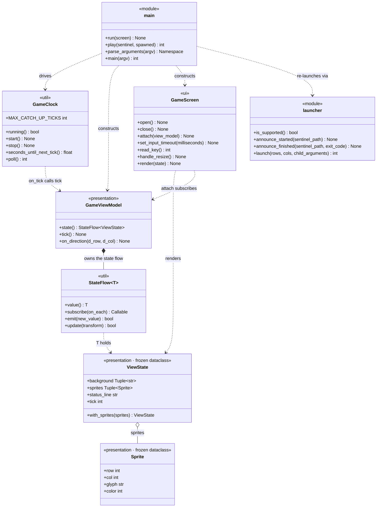

# Class Overview

The app's classes, diagrammed and then tabulated. Generated from the source by
walking the AST, so signatures and docstrings are verbatim.

**Six classes** are covered: two frozen dataclasses and four that carry the
behaviour. The two exception types are deliberately left out.

**Public members only.** Anything named with a leading underscore is omitted —
private fields, private methods, and private module constants alike. Dunder
methods are kept, because `__init__` is the constructor and `__enter__` /
`__exit__` are the context-manager protocol callers actually use.

The entry point
and the window launcher are modules of plain functions rather than classes; they
are shown in the diagram as `<<module>>` boxes and tabulated in their own section
at the end, because leaving them out would hide how everything is wired together.

## Diagram

The one-way flow the diagram encodes:

    GameClock --tick()--> GameViewModel --StateFlow<ViewState>--> GameScreen

`GameViewModel` never imports curses, and `GameScreen` never asks the ViewModel
for anything — it subscribes once and is pushed complete frames.

---

## `GameClock`

`terminalgame/util/clock.py`

> Calls `on_tick` once every `interval_seconds`, driven by poll().

### Fields

| Signature | Description |
|---|---|
| `MAX_CATCH_UP_TICKS = 3` | Class constant. If the process is suspended (Ctrl-Z, laptop sleep), don't try to replay hours of missed ticks — fire at most this many, then resynchronise. |

### Methods

| Signature | Docstring |
|---|---|
| `__init__(self, interval_seconds: float, on_tick: Callable[[], None]) -> None` | — |
| `running(self) -> bool` *(property)* | — |
| `start(self) -> None` | Begin ticking. The first tick lands one full interval from now. |
| `stop(self) -> None` | — |
| `seconds_until_next_tick(self) -> float` | — |
| `poll(self) -> int` | Fire any ticks that are due. Returns how many fired.  Advancing the deadline by whole intervals (rather than resetting it to `now`) stops the tick rate drifting slower over a long session. |

---

## `StateFlow[T]`

`terminalgame/util/flow.py` — inherits `Generic[T]`

> Holds a current value and notifies subscribers when it changes.
>
> Mirrors StateFlow semantics:
> - always has a value (no "empty" state)
> - new subscribers immediately receive the current value
> - conflated / distinct-until-changed: emitting an equal value is a no-op

### Fields

None public. The value and the subscriber list are both private; `value` is
reachable read-only through the property below.

### Methods

| Signature | Docstring |
|---|---|
| `__init__(self, initial: T) -> None` | — |
| `value(self) -> T` *(property)* | — |
| `subscribe(self, on_each: Callable[[T], None]) -> Callable[[], None]` | Register a collector. It is invoked at once with the current value.  Returns a function that unsubscribes, so callers can use it like a Job. |
| `emit(self, new_value: T) -> bool` | Publish a new value. Returns True if it differed from the last one.  Equality is what makes this cheap: ViewState is a frozen dataclass, so an unchanged frame costs one comparison and does not touch the screen. |
| `update(self, transform: Callable[[T], T]) -> bool` | Emit transform(current) — the equivalent of MutableStateFlow.update. |

---

## `Sprite`

`terminalgame/presentation/state.py` — `@dataclass(frozen=True)`

> A single moving glyph drawn on top of the background.

### Fields

| Signature | Description |
|---|---|
| `row: int` | Playfield row. |
| `col: int` | Playfield column. |
| `glyph: str` | The character drawn. |
| `color: int = COLOR_DEFAULT` | Logical colour slot, mapped to a curses pair by `GameScreen`. |

### Methods

None — the dataclass decorator generates `__init__`, `__eq__`, and `__hash__`.

---

## Module constants — `terminalgame/presentation/state.py`

`Sprite.color` and `GameScreen` speak in these logical slots, so the ViewModel
never has to import curses.

| Signature | Description |
|---|---|
| `PLAYFIELD_ROWS = 30` | The fixed playfield height. The terminal window is resized to match at startup. |
| `PLAYFIELD_COLS = 80` | The fixed playfield width. |
| `COLOR_DEFAULT = 0` | No colour pair; drawn with `A_NORMAL`. |
| `COLOR_WALL = 1` | Mapped to blue by `GameScreen` when it opens. |
| `COLOR_PLAYER = 2` | Mapped to yellow. |
| `COLOR_GHOST = 3` | Mapped to red. |
| `COLOR_STATUS = 4` | Mapped to cyan. |

---

## `ViewState`

`terminalgame/presentation/state.py` — `@dataclass(frozen=True)`

> One complete frame.
>
> `background` is the static maze; `sprites` are the things that move. They are
> separated only for clarity — GameScreen redraws both every frame and lets
> ncurses work out what actually changed.

### Fields

| Signature | Description |
|---|---|
| `background: Tuple[str, ...]` | The static maze, one string per row. |
| `sprites: Tuple[Sprite, ...]` | The things that move, drawn over the background. |
| `status_line: str` | The bottom line of the window. |
| `tick: int = 0` | Simulation step this frame represents. |

### Methods

| Signature | Docstring |
|---|---|
| `with_sprites(self, *sprites: Sprite) -> "ViewState"` | — |

---

## `GameViewModel`

`terminalgame/presentation/view_model.py`

> Turns ticks and key presses into ViewStates.

### Fields

None public. The maze, tick count, and player and ghost positions are all
private — the only way in is `tick()` and `on_direction()`, and the only way out
is the `state` property.

### Methods

| Signature | Docstring |
|---|---|
| `__init__(self) -> None` | — |
| `state(self) -> StateFlow[ViewState]` *(property)* | The flow GameScreen collects from. |
| `tick(self) -> None` | Called by GameClock. Advance the simulation by one step. |
| `on_direction(self, d_row: int, d_col: int) -> None` | Called by GameScreen when the player presses an arrow key. |

---

## `GameScreen`

`terminalgame/ui/screen.py`

> Owns the curses lifetime and paints ViewStates onto the terminal.

### Fields

None public. The curses window, the requested size, the unsubscribe callable,
and the colour-pair map are all private.

### Methods

| Signature | Docstring |
|---|---|
| `__init__(self, rows: int = PLAYFIELD_ROWS, cols: int = PLAYFIELD_COLS) -> None` | — |
| `__enter__(self) -> "GameScreen"` | — |
| `__exit__(self, exc_type, exc, tb) -> bool` | — |
| `open(self) -> None` | — |
| `close(self) -> None` | — |
| `attach(self, view_model) -> None` | Collect the ViewModel's state flow. Renders the current frame at once. |
| `set_input_timeout(self, milliseconds: int) -> None` | Bound how long getch() blocks, so the main loop can also poll the clock. |
| `read_key(self)` | Return a key code, or None if the timeout elapsed with no input. |
| `handle_resize(self) -> None` | Re-measure after KEY_RESIZE and repaint from scratch. |
| `render(self, state: ViewState) -> None` | Draw one complete frame. This is the StateFlow collector. |

---

# Modules of functions

Neither of these is a class, but both are part of the app and appear in the
diagram above as `<<module>>` boxes.

## `terminalgame.app.main`

> Entry point.
>
>     python3 -m terminalgame.app.main           # opens the game in its own 30x80 window
>     python3 -m terminalgame.app.main --here    # runs in the current terminal instead
>
> Without --here the process re-launches itself inside a new Terminal.app window
> (see terminalgame/app/launcher.py), then blocks until the game exits and
> forwards its exit code, so it still behaves like an ordinary command.

### Constants

| Signature | Description |
|---|---|
| `TICK_INTERVAL_SECONDS = 0.15` | The simulation step. Roughly 1/7 s — fast enough for the ghost to read as moving rather than teleporting. |
| `INPUT_POLL_MILLISECONDS = 33` | How long `getch()` may block before the clock is checked again. This is input latency, not frame rate. |

### Functions

| Signature | Docstring |
|---|---|
| `run(screen: GameScreen) -> None` | — |
| `play(sentinel: str, spawned: bool) -> int` | Run the game in whatever terminal this process already owns. |
| `parse_arguments(argv)` | — |
| `main(argv=None) -> int` | — |

## `terminalgame.app.launcher`

> Spawns the game in its own correctly-sized Terminal.app window.
>
> Terminal.app's scripting interface exposes writable `number of rows` and
> `number of columns` on a tab, so the window is created at exactly 30x80 rather
> than being opened at the default size and resized afterwards — no visible snap.
> `tty` on the same tab is what lets us find the window we just made and close it
> again when the game exits.
>
> The launcher process stays alive in the original terminal, waiting on a
> sentinel file the game writes, so `python3 -m terminalgame.app.main` behaves
> like a normal blocking command and forwards the game's exit code.

### Constants

| Signature | Description |
|---|---|
| `STARTUP_TIMEOUT_SECONDS = 20.0` | How long to wait for the child to announce itself before assuming it never started. |
| `MAIN_MODULE = "terminalgame.app.main"` | The child is re-run as a module, so the project root — not the launcher's directory — is what the shell must `cd` to. |
| `WINDOW_TITLE = "Terminal Game"` | Shown in the title bar, in place of the internal command line. |
| `ENV_CHILD = "TERMINALGAME_CHILD"` | Set to `1` in the spawned child's environment. |
| `ENV_SENTINEL = "TERMINALGAME_SENTINEL"` | Path of the sentinel file the child writes. |
| `POLL_INTERVAL_SECONDS = 0.1` | Sentinel polling interval — a `stat()` on a local file, not an AppleScript call. |
| `CHILD_EXIT_TIMEOUT_SECONDS = 5.0` | Bounded wait for the child process to leave before touching its window. |

### Functions

| Signature | Docstring |
|---|---|
| `is_supported() -> bool` | True when we can drive Terminal.app on this machine. |
| `announce_started(sentinel_path: Optional[str]) -> None` | Called by the child once it is running, so the launcher can watch it. |
| `announce_finished(sentinel_path: Optional[str], exit_code: int) -> None` | Called by the child on the way out, cleanly or otherwise. |
| `launch(rows: int, cols: int, child_arguments: List[str]) -> int` | Open the game in a new window and block until it exits.  Returns the game's exit code. |

---

## A note on the dashes

Python fields have no docstrings, so the **Description** column for fields and
constants is drawn from the inline comment above the declaration where one
exists, and written from the code where one doesn't. A `—` in a **Docstring**
column means the method genuinely has none in the source.

Sections reading "None public" are not empty classes — those classes keep real
state, it is simply all private and therefore out of scope for this document.
