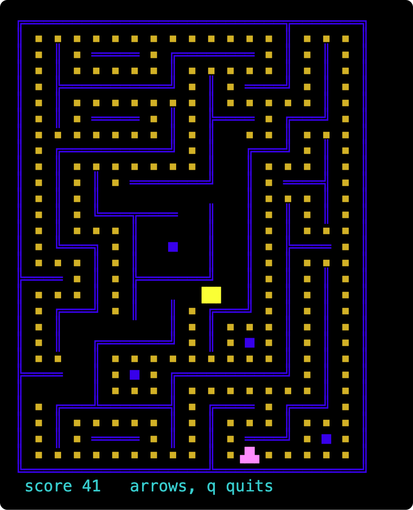

# Terminal Game Skeleton

A retro, character-based game skeleton for macOS built on Python's stdlib `curses`.
No dependencies — the system Python 3.9 already ships everything needed.

    cd TerminalGame
    python3 -m terminalgame.app.main         # opens the game in its own 30x40 window
    python3 -m terminalgame.app.main --here  # runs in the current terminal instead

Arrows move, `q` or Esc quits. The maze is different every game. To drive it from a
script instead of by hand, see [Driving it headlessly](#driving-it-headlessly).

A real frame, not a mock-up: the game was played through the
[run skill](.claude/skills/run-terminalgame/SKILL.md), the frame was read back
out of a false terminal, and every character was drawn in the colour the game
gave it. The cleared corridors are where the player has already been — the
score is the count of them.

There is [half a minute of it being played](docs/images/the-game-being-played.gif)
as well — the player working through the pills, keeping out of the ghost's way,
and then turning round and walking straight into it. Same method: a real game,
recorded a frame at a time through the same false terminal.

## Structure

    terminalgame/
      app/
        main.py                    wiring + the main loop
        launcher.py                spawns the game's own Terminal window
      presentation/
        state.py                   ViewState     — one immutable frame
        maze.py                    Maze          — the carved playfield
        view_model.py              GameViewModel — game logic, owns the state
      ui/
        screen.py                  GameScreen    — curses rendering + keyboard
      util/
        clock.py                   GameClock     — fixed-timestep tick source
        flow.py                    StateFlow     — the pub/sub primitive

`presentation` imports from `util`; `ui` imports `ViewState` from
`presentation`; neither imports the other. `app` wires all three together and is
the only package that imports from every other one.

The game thinks in **cells**, not characters. A cell is one row by two columns,
which is very nearly square because a terminal character is about twice as tall
as it is wide. That makes a 30x40 window a playfield of 29 by 20 cells, and the
maze inside it 29 by 19 — a maze needs an odd number of cells across or its
border comes out two cells thick down one side.

There is no module to run by path — `main` uses relative imports, so it is
started as a module: `python3 -m terminalgame.app.main`.

Dependencies point one way:

    GameClock --tick()--> GameViewModel --StateFlow<ViewState>--> GameScreen

`GameViewModel` never imports curses; `GameScreen` never asks the ViewModel for
anything. The screen subscribes once at startup and is pushed complete frames.

## Full state or deltas?

**Publish the full ViewState. ncurses does the delta itself, and better.**

`refresh()`/`doupdate()` diffs the in-memory back buffer against what is
physically on the terminal and emits escape codes only for cells that actually
changed. Measured on this skeleton at 30x40:

    first paint      10657 bytes
    a tick           65-94 bytes
    an arrow key     67-94 bytes
    unchanged state      0 bytes

Every one of those ticks published a whole 30x40 ViewState. Hand-rolling deltas
in the ViewModel would add bookkeeping and could not beat that. The ranges are
colour: a frame that switches between the player's yellow, the pills' gold and
the ghost's pink costs a few bytes more than one that does not.

### What ncurses is doing to earn that

The claim above is the premise the rest of the design rests on, so it is worth
saying how it works rather than taking it on faith.

ncurses keeps two pictures of the screen. `newscr` is the virtual screen, which
is what the program says it wants; `curscr` is what ncurses believes is
physically on the terminal. `addnstr` touches neither — it writes into the
window's own cells. `noutrefresh()` copies the window's *touched* lines into
`newscr` and sends nothing at all. `doupdate()` then walks `newscr` against
`curscr` and emits output only for the cells where the two differ.

That last comparison is the whole reason a full repaint is cheap. Drawing every
row marks every line touched, so the per-line bookkeeping saves nothing here —
but the comparison underneath it is on content, and content that did not change
produces no output however many times it was rewritten. A steady frame costs
1,200 cell comparisons and 65 bytes down the wire.

Two further layers sit below that, and both show up in the numbers above:

* **Cursor optimization.** Having found a run of changed cells, ncurses does not
  simply address them absolutely. It costs the alternatives — relative moves,
  tab, carriage return, home-and-move, absolute addressing — against what
  terminfo says this terminal can do, and picks the cheapest. Two columns right
  is usually two `cuf1`s rather than a six-byte `CUP`.
* **Attribute batching.** Colour is emitted on transition only. That is exactly
  the 65-to-94 spread: the extra bytes in a busy frame are `SGR` sequences, not
  cells.

There is a third, unused here: ncurses hashes lines to recognise content that
merely moved, and can scroll or insert/delete lines instead of repainting them.
`idcok` (characters) is on by default, `idlok` (lines) off, because hardware
line insertion is visually annoying where it is not needed. A maze that never
scrolls gives it nothing to find.

Only some of this is documented. `curs_refresh(3x)` covers the virtual and
physical screens and the touched-lines rule; `curs_outopts(3x)` covers
`clearok`, `idlok` and `idcok` and is candid about why the defaults are what
they are. The cursor cost model and the line hashing are explained only in the
ncurses source, in `tty_update.c` and `hashmap.c`. Python's own documentation
for `doupdate` is a single sentence.

Three things keep it artifact-free, all in `screen.py`:

* `erase()`, never `clear()` — `clear()` sets `clearok`, which makes the next
  `doupdate()` throw away what it knows about the terminal and repaint from
  scratch. That is the 10,657-byte first paint, on every frame, and exactly the
  flicker to avoid.
* `noutrefresh()` + `doupdate()` — one atomic write per frame rather than one
  syscall burst per window.
* `curs_set(0)` plus parking the caret bottom-left — nothing tracks the draw
  position across the screen.

The fourth guard is in `flow.py`: `ViewState` is a frozen dataclass, so
`StateFlow.emit` compares by value and drops an unchanged frame before curses
is touched at all (the 0-byte row above). Had one got through, `doupdate()`
would have found no differing cells and written nothing anyway — so that guard
saves the redraw and the comparison, not the bytes.

## Threading

There is none, deliberately. `curses` is not thread-safe — a tick arriving on a
`threading.Timer` while the main thread is mid-refresh corrupts the display. So
`GameClock` is a monotonic deadline polled from the main loop, and `getch()` is
given a 33 ms timeout so input stays responsive between ticks. Tick handling
and rendering are therefore always ordered and always on one thread.

`GameClock` advances its deadline by whole intervals rather than resetting to
`now`, so the tick rate does not drift slower over a long session, and caps
catch-up at 3 ticks so a suspended process doesn't replay hours of backlog.

## Its own window

`python3 -m terminalgame.app.main` does not play in the terminal you typed it
into. It re-launches itself inside a fresh Terminal.app window and blocks until
the game exits, forwarding its exit code, so it still behaves like a normal
command.

Terminal.app's `tab` class exposes writable `number of rows` and `number of
columns`, so the window is created at exactly 30x40 rather than opened at the
default size and resized afterwards — there is no visible snap. The `tty`
property on the same tab is how the launcher identifies the window it just made
so it can close it again at the end.

Two things that are easy to get wrong here, both handled in `launcher.py`:

* **Don't close a window whose process is still alive.** The game writes its
  exit code to a sentinel file *before* the interpreter finishes unwinding. Ask
  Terminal to close the window in that gap and it puts up a "terminate running
  process?" modal, which blocks every subsequent AppleScript call. The launcher
  waits for the pid to actually disappear, and the close script checks `busy`
  as a second guard.
* **Never let the child spawn.** `launch()` refuses outright if
  `TERMINALGAME_CHILD=1` is already in its environment. Without that guard, any
  caller that fails to detect it is the spawned child opens another window,
  whose child opens another, and each generation is a real window on screen.
* **Terminal keeps closed windows in `every window` for a while**, as husks
  with zero tabs. Reading `selected tab` of one raises, which aborts the whole
  `repeat` loop before it reaches the window you care about. Every per-window
  access is wrapped in `try`.

The launcher watches a sentinel file rather than polling Terminal over
AppleScript, so a running game costs two `osascript` invocations in total. The
child records its pid there first, so if you close the window by hand the
launcher notices the process die instead of waiting forever.

The child is configured through environment variables (`TERMINALGAME_CHILD`,
`TERMINALGAME_SENTINEL`) rather than argv, because Terminal appends the running
process's arguments to the window title and that part is not scriptable. The
title reads `Terminal Game — Python -m terminalgame.app.main`, with no sentinel
path trailing it; the surrounding pieces come from global Terminal preferences
and are deliberately left alone.

### --here, and the escape-sequence fallback

`--here` plays in the current terminal. That path still needs to size the
window itself, so `GameScreen.open()` writes the xterm sequence
`ESC [ 8 ; 30 ; 40 t`, which Terminal.app and iTerm2 both honour, waits 150 ms
for the resize to land, then verifies with `getmaxyx()` and raises
`TerminalTooSmall` if the terminal ignored it. It runs on the spawned path too,
where it is a harmless no-op since the window is already the right size, and it
is what would size an iTerm2 window if you taught the launcher to use one.

A larger window is fine either way — the playfield stays 30x40 in the top-left.
`KEY_RESIZE` is handled mid-game.

## Driving it headlessly

A curses screen cannot be read back from stdout, which makes the game awkward
to check without playing it. `.claude/skills/run-terminalgame/driver.py` gives
it the two things curses needs that a pipe cannot: `pty.fork()` for a real
terminal, and `pyte` to replay the escape codes it writes into a character
grid. Keys go in, whole frames come back as text:

    ./.claude/skills/run-terminalgame/driver.py <<'EOF'
    show start
    right 3
    down 3
    status
    quit
    EOF

`show` prints the 30x40 screen, `status` prints just the bottom row — which is
what to assert on, since the maze is carved fresh each game and the ghost moves
on its own, while `at 13,12` changes only in response to your keys. The driver
installs `pyte` into a virtualenv beside itself on first run; the game itself
still needs nothing beyond the stdlib.

Arrows have to be sent as `ESC O C`, not `ESC [ C`. `keypad(True)` emits `smkx`
at startup, and in application cursor mode ncurses recognises only that form —
the CSI form arrives as a bare `27`, which is in `_QUIT_KEYS`, so the game
exits on the first arrow press and the next write to the pty fails with `EIO`.
It looks exactly like a crash on input and is nothing of the kind. That trap
and the rest of them are written down in the skill's
[`SKILL.md`](.claude/skills/run-terminalgame/SKILL.md), which Claude Code loads
by itself when asked to run the game.

## Tuning knobs

| What | Where |
|---|---|
| Tick rate (currently 0.15 s) | `TICK_INTERVAL_SECONDS` in `terminalgame/app/main.py` |
| Input latency | `INPUT_POLL_MILLISECONDS` in `terminalgame/app/main.py` |
| Playfield size | `PLAYFIELD_ROWS` / `PLAYFIELD_COLS` in `terminalgame/presentation/state.py` |
| Cell shape | `CELL_ROWS` / `CELL_COLS` in `terminalgame/presentation/state.py` |
| The maze | `Maze.generate()` in `terminalgame/presentation/maze.py` |
| Wall, pill and sprite glyphs | the constants at the top of `terminalgame/presentation/view_model.py` |
| Colours | `_init_colors()` in `terminalgame/ui/screen.py` |
| Window title, font size, background | `WINDOW_TITLE` / `FONT_SIZE` / `BACKGROUND_COLOR` in `terminalgame/app/launcher.py` |

## Next steps

A game is lost outright. The ghost catching the player ends it there and then,
with no lives to spend and no way to start another without quitting and running
the command again. Lives are the obvious next feature, and they need the
decisions a single ending let the skeleton avoid: what a life costs, whether
the maze is recarved or the eaten pills stay eaten, and where the player and
the ghost stand when play resumes.

The ghost does not hunt. It carries straight on until it runs out of corridor
and then turns at random, so it finds the player by wandering into them. It
knows where the player is -- the same object holds both positions -- and does
nothing with that.

The maze is random rather than authored. A real Pac-Man maze is 28x31 cells,
which at one row by two columns per cell needs a 56 by 32 window rather than
this one's 40 by 30.

## Documentation

[`docs/`](docs/) holds a [class overview](docs/CLASS_OVERVIEW.md) and, in
[`docs/scenarios/`](docs/scenarios/), one document per collaboration in the
program, each with a sequence diagram and a step-by-step account of what passes
between the parts. Start from the
[scenario index](docs/scenarios/SCENARIO_INDEX.md), which carries a reading
order in three laps.

[`docs/lessons/`](docs/lessons/) is for a reader who knows Kotlin or Java and
not Python. Two documents, each covering the subset of the language one file
actually uses and nothing else: [`view_model.py`](docs/lessons/view_model_py.md)
for the everyday syntax, and [`flow.py`](docs/lessons/flow_py.md) for generics,
functions as values and closures. Worth reading before the scenarios if the
language is in the way.

[`docs/pydocs/`](docs/pydocs/) is the API reference, generated by `pydoc`
straight from the source: one page per module, carrying the signatures and
docstrings as they are in the code. Open
[`docs/pydocs/index.html`](docs/pydocs/index.html) in a browser — GitHub shows
the source of an HTML file rather than rendering it, so these are worth reading
locally. That page also carries the command that regenerates them.
