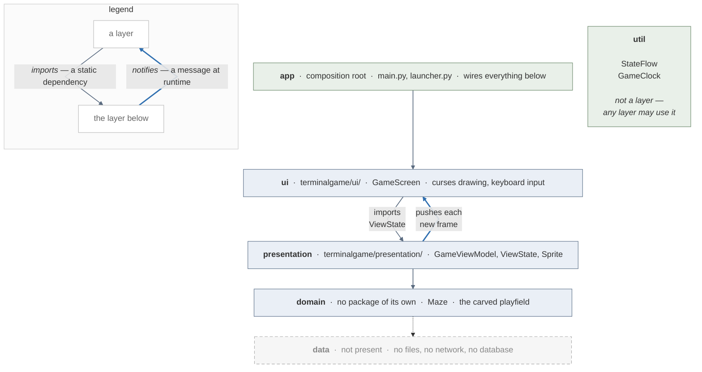

# Architecture

The program is four layers deep in principle and two and a half in practice.
`ui` and `presentation` are real packages with real contents. `domain` exists as
code but has no package of its own — it sits inside `presentation`. `data` is
not there at all, and the reason is not an oversight: nothing in this game
outlives the process.

Two packages carry no layer at all. `util` is game-agnostic plumbing that every
layer is allowed to use, and `app` is the composition root that wires the rest
together.



Read it as a cake, and mind the two kinds of arrow, which the legend spells out.

The thin grey ones are **static dependencies** — who imports whom. They point
down the stack and never back up: `ui` imports `ViewState` from `presentation`,
`presentation` imports `Maze` and `util`, and nothing lower names anything
higher.

The thick blue one is a **message at runtime**, and it runs the other way:
`GameViewModel` pushes a new `ViewState` up to `GameScreen` on every frame that
changes. That is not an import. The subscription is handed over in `app`, so the
ViewModel can send a message upward without knowing there is anything up there.
`GameClock` reaches the ViewModel through a callback supplied the same way, and
key presses take the long way round — `GameScreen` hands the key code to the
loop in `app`, which calls `GameViewModel.on_direction()`.

`app` sits on top because it is the only package that knows all of the others;
`util` sits beside the stack rather than in it, because every layer may use it
and it belongs to none. The bottom slab is dashed because there is nothing in
it.

## ui

`terminalgame/ui/` — one class, `GameScreen`. The only code in the program that
imports `curses` or knows that Terminal.app exists. It paints a `ViewState` and
reads the keyboard, and that is the whole of its job.

It is a strictly downstream layer. `GameScreen` subscribes to the ViewModel once
at startup and is pushed complete frames from then on; it never asks the
ViewModel for anything, and nothing in `presentation` imports it. The only thing
that travels up that side of the diagram is a frame, down a subscription — the
missing upward *import* is the rule that makes the REPL tour possible. You can
drive the entire game from a `python3` prompt because none of the logic needs a
terminal to exist.

## presentation

`terminalgame/presentation/` — `GameViewModel` holds the game and `ViewState`
describes a single frame of it. The ViewModel owns the score, the pills, the two
sprite positions and the rules that move them; it publishes each new frame
through a `StateFlow` and never learns who is collecting them.

`ViewState` is immutable and complete. There are no deltas — every tick emits a
whole frame, and `StateFlow.emit` drops it if it is equal to the last one, which
is what keeps an idle game from writing to the terminal at all.

## domain

There is domain logic here, but no `domain/` package. It is in two places:

- **`Maze`** (`presentation/maze.py`) is the domain model proper — a carved,
  braided grid that knows about cells, neighbours, dead ends, reachability and
  islands. It knows nothing about pills, scores, sprites or drawing, and it
  imports nothing from the rest of the program. It is the one class here that
  would move into a `domain/` package unchanged.
- **The rules** — what eating a pill does, when the ghost catches the player,
  when the game is over — live in `GameViewModel` alongside the state they act
  on, rather than in domain objects of their own.

For a game of this size that is a reasonable place for them. The seam to watch
is `GameViewModel`: if the rules grow enough that it is hard to say whether a
method is a rule or a presentation concern, that is the signal to lift them out.

## data

Empty, deliberately. Nothing in the game persists: the maze is generated fresh
from a seed on every run, the score starts at zero and is gone when the process
ends, and there is no high-score table, no save game and no configuration file —
the tuning knobs are constants in the source and arguments on the command line.
No layer opens a socket or reads a file.

The one place the program touches the filesystem at all is `app/launcher.py`,
which writes a temporary script and a sentinel file in order to start the game
in its own Terminal.app window and find out how it exited. That is process
plumbing rather than game data: it lives in the composition root, it is gone
with the window, and no layer above it reads any of it.

If a data layer is ever wanted, the dashed slab at the bottom of the diagram is
where it goes: a repository handed to `GameViewModel` at construction, in `app`,
where everything else is wired. It must not be reached from `ui`.

## The packages that are not layers

**`util/`** — `StateFlow`, a synchronous publish/subscribe value holder, and
`GameClock`, a fixed-timestep tick source. Neither knows what a playfield is and
neither imports curses. Both are single-threaded on purpose: curses is not
thread-safe, so ticks and state emissions all happen on the main loop's thread.

**`app/`** — the composition root. `main.py` parses arguments, builds the
objects, and runs the loop; `launcher.py` opens the Terminal.app window that
loop runs in. This is the only package that imports from every other one, which
is what lets every other package stay ignorant of how it is assembled.

## The dependency rule

One direction, no exceptions:

```
app  →  ui  →  presentation  →  domain
                    ↓
                   util
```

`presentation` imports from `util`. `ui` imports `ViewState` from
`presentation`. Neither imports the other. `app` wires all three and is imported
by none of them.

Stated as a runtime path, which is the same rule seen from the side:

```
GameClock --tick()--> GameViewModel --StateFlow<ViewState>--> GameScreen
```

## Where to read next

- [The glossary](GLOSSARY.md) — cell, layer, glyph, braid, island, sentinel:
  the words this document and the code both assume.
- [The class overview](CLASS_OVERVIEW.md) — every public member, with the
  docstring it was written with.
- [How a game begins and ends](LIFECYCLE.md) — the four endings as one state
  diagram, and which layer decides each of them.
- [The scenario index](scenarios/SCENARIO_INDEX.md) — one document per
  collaboration, each with a sequence diagram showing these layers in motion.
- [A tour from a Python prompt](REPL_TOUR.md) — drives `presentation`, `domain`
  and `util` with the `ui` layer left out entirely, which is the clearest
  demonstration that the arrows above point the way this document claims.
- [The lessons](lessons/) — enough Python to read a given file, for somebody
  fluent in Kotlin or Java. One per layer that has anything unusual in it:
  [`view_model.py`](lessons/view_model_py.md) and [`flow.py`](lessons/flow_py.md)
  for `presentation` and `util`, [`screen.py`](lessons/screen_py.md) for `ui`,
  and [`launcher.py`](lessons/launcher_py.md) for `app`.
