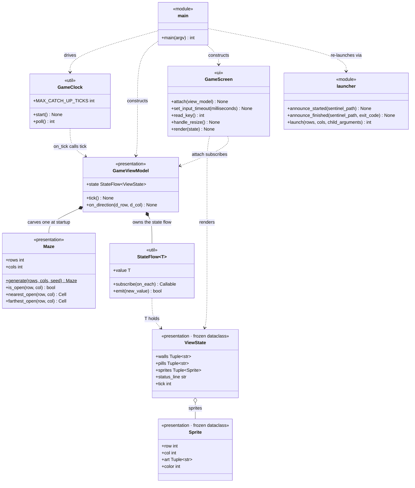

# Class Overview

The app's classes and modules in the source's own words: a diagram carrying
every public member, then, module by module, the docstring at the head of the
file, the docstring on each class, and every public method with the signature
and the docstring it was written with. Generated by walking the AST, so both
are verbatim.

**Seven classes** carry the app: two frozen dataclasses and five that do the
work. Two exception types make nine in all. Those two are listed below, beside
the modules that raise them, but stay out of the diagram — a box for a one-line
class would be noise in it.

## How to read it

- **Order is file order.** Methods appear in the order they appear in the
  Python file, not alphabetically and not grouped by kind, so reading a class
  here is reading it top to bottom.
- **An underlined signature is a `@classmethod`.** UML underlines members that
  belong to the class rather than to an instance, and that is what a
  `@classmethod` is. Only two exist — <u><code>Maze.generate</code></u> and
  <u><code>Maze.from_rows</code></u> — and the diagram underlines the same two.
- **A `@property` is an attribute, not an operation.** All five in the app are
  read-only, and they are written the way they are read — `maze.rows`, never
  `maze.rows()` — so the diagram lists them in its attribute compartment and the
  text below gives each a type rather than a signature. Each is still tagged
  `@property`, since that is what makes an attribute out of a method.
- **Public members only.** Anything named with a leading underscore is omitted:
  private fields, private methods, and private module constants. The diagram
  and the text below hold the same set.
- **Google sections become bullets.** Some docstrings end in a labelled `Args`,
  `Attributes` or `Raises` list. The words are the docstring's and only the
  indentation changed, because four-space indentation inside a quotation
  renders as a code block and an argument list is not code.

The entry point and the window launcher are modules of plain functions rather
than classes. They are shown in the diagram as `<<module>>` boxes and appear
below in the same form as everything else, because leaving them out would hide
how it is all wired together.

## Diagram

The one-way flow the diagram encodes:

    GameClock --tick()--> GameViewModel --StateFlow<ViewState>--> GameScreen

`GameViewModel` never imports curses, and `GameScreen` never asks the ViewModel
for anything — it subscribes once and is pushed complete frames.

---

# Module by module

## `terminalgame/presentation/maze.py`

> A rectangular grid of cells, each either wall or open corridor.
>
> Knows nothing about characters, colours or sprites: a cell is open or it is
> not. That is what lets a maze be built, queried and asserted about without a
> terminal, and what lets a test build one by hand from a few lines of text.
>
> Two ideas run through the generation, and they are worth separating.
>
> A **perfect** maze has exactly one route between any two cells. Carving one is
> the easy part -- a depth-first walk between junctions does it -- but a perfect
> maze is nothing but dead ends, because every branch that is not the route to
> somewhere terminates.
>
> **Braiding** is the pass that removes them. Wherever a junction has only one
> way out, a second is opened. That destroys the perfectness on purpose: the
> maze gains loops, and the wall between two corridors that were joined becomes
> part of an island rather than part of the border.

### `Maze`

> A rectangular grid of cells, each either open corridor or wall.
>
> Nothing here knows about characters, colours or sprites, which is what
> lets a maze be built, queried and asserted about without a terminal.

#### <u><code>generate(rows: int, cols: int, seed: Optional[int]=None) -> Maze</code></u> · `@classmethod`

> Carves a random maze of this size and braids its dead ends away.
>
> The outermost cells are always wall, so the result has a border.
>
> **Args**
> - `rows` — Height of the maze in cells.
> - `cols` — Width of the maze in cells.
> - `seed` — Seed for the carving. A seed makes the maze reproducible, which is the only way a test can assert anything about a particular one. None gives a different maze every time.
>
> **Returns**
> A braided maze of that size, with a wall border and no dead ends.
>
> **Raises**
> - `ValueError` — If the size leaves a junction with fewer than two junction neighbours, which braiding cannot open a second exit for: that needs at least five rows and five columns.

#### <u><code>_from_rows(rows: Sequence[str], open_char: str='.') -> Maze</code></u> · `@classmethod`

> Builds a maze from lines of text, for tests that need a known shape.
>
>     Maze._from_rows(["#####",
>                     "#...#",
>                     "#.#.#",
>                     "#...#",
>                     "#####"])
>
> **Args**
> - `rows` — One string per cell row, all of the same length.
> - `open_char` — The character that marks corridor. Any other character is wall.
>
> **Returns**
> A maze of exactly the shape those rows describe.

#### <code>rows: int</code> · `@property`

> The height of the maze in cells.

#### <code>cols: int</code> · `@property`

> The width of the maze in cells.

#### <code>is_open(row: int, col: int) -> bool</code>

> Reports whether a cell is corridor.
>
> **Args**
> - `row` — Cell row.
> - `col` — Cell column.
>
> **Returns**
> True if the cell is corridor. Out of bounds counts as wall.

#### <code>_open_cells() -> Tuple[Cell, ...]</code>

> Returns every corridor cell, in row-major order.

#### <code>_wall_cells() -> Tuple[Cell, ...]</code>

> Returns every wall cell, in row-major order.

#### <code>_neighbours(row: int, col: int) -> Tuple[Cell, ...]</code>

> Returns the cells adjacent to one cell, wall or not.
>
> **Args**
> - `row` — Cell row.
> - `col` — Cell column.
>
> **Returns**
> The neighbours that fall inside the grid, north, south, west and
> east in that order.

#### <code>_open_neighbours(row: int, col: int) -> Tuple[Cell, ...]</code>

> Returns the corridor cells adjacent to one cell.
>
> **Args**
> - `row` — Cell row.
> - `col` — Cell column.
>
> **Returns**
> The neighbours from `_neighbours` that are corridor, so the ways
> out of this cell.

#### <code>_dead_ends() -> Tuple[Cell, ...]</code>

> Returns the open cells with fewer than two ways out.
>
> A braided maze has none. This returns the cells rather than a
> yes-or-no so that a failure says *where*.

#### <code>_reachable_from(row: int, col: int) -> FrozenSet[Cell]</code>

> Returns every open cell that can be walked to from one cell.
>
> **Args**
> - `row` — Cell row to start from.
> - `col` — Cell column to start from.
>
> **Returns**
> The cells reachable from there, including the starting cell, or an
> empty set if the starting cell is wall.

#### <code>_is_fully_connected() -> bool</code>

> Reports whether every open cell can be reached from every other.
>
> **Returns**
> True if the corridors form one connected region. An empty maze
> counts as connected.

#### <code>_islands() -> Tuple[FrozenSet[Cell], ...]</code>

> Returns the wall regions that do not touch the border.
>
> These are the solid blocks the corridors run around. They hold no dots
> because they hold no open cells, which is true by construction rather
> than by anything having to go looking for them.
>
> **Returns**
> One frozen set of cells per island, in no particular order.

#### <code>nearest_open(row: int, col: int) -> Cell</code>

> Returns the open cell closest to a wanted spot.
>
> **Args**
> - `row` — Row of the wanted spot, which may itself be wall.
> - `col` — Column of the wanted spot.
>
> **Returns**
> The corridor cell at the smallest distance from that spot.

#### <code>farthest_open(row: int, col: int) -> Cell</code>

> Returns the open cell furthest from a spot.
>
> Paired with `nearest_open`, this is what keeps two things placed by
> these two calls from starting on top of each other, whatever shape the
> maze took.
>
> **Args**
> - `row` — Row of the spot to get away from.
> - `col` — Column of the spot to get away from.
>
> **Returns**
> The corridor cell at the greatest distance from that spot.

#### <code>_to_rows(wall: str='#', corridor: str='.') -> Tuple[str, ...]</code>

> Draws the maze as text, for a test failure message or a print.
>
> **Args**
> - `wall` — The character to draw wall cells with.
> - `corridor` — The character to draw open cells with.
>
> **Returns**
> One string per cell row.

---

## `terminalgame/presentation/state.py`

> Immutable view state -- everything GameScreen needs to draw one frame.
>
> Frozen dataclasses give us value equality for free, which is what lets
> StateFlow skip redundant emissions, and guarantees the ViewModel can never
> mutate a frame the screen is still holding.

### Constants

The playfield is measured twice over: in terminal character positions, which is
what `GameScreen` draws in, and in game cells, which is what the game thinks in.

| Signature | Description |
|---|---|
| `PLAYFIELD_ROWS = 30` | The playfield's height in character rows. The terminal window is resized to match at startup. |
| `PLAYFIELD_COLS = 40` | The playfield's width in character columns. |
| `CELL_ROWS = 1` | A game cell's height in character rows. |
| `CELL_COLS = 2` | A game cell's width. A terminal character is about twice as tall as it is wide, so two columns by one row is very nearly square. |
| `GRID_ROWS = 29` | The playfield in cells, derived. The last character row is the status line, so it is taken off before dividing. |
| `GRID_COLS = 20` | The playfield's width in cells, derived. |
| `COLOR_DEFAULT = 0` | No colour pair; drawn with `A_NORMAL`. |
| `COLOR_WALL = 1` | Mapped to blue by `GameScreen` when it opens. |
| `COLOR_PLAYER = 2` | Mapped to a bright yellow. |
| `COLOR_GHOST = 3` | Mapped to a bright pink. |
| `COLOR_STATUS = 4` | Mapped to cyan. |
| `COLOR_PILL = 5` | Mapped to a darker gold, so a pill is dimmer than the player moving over it. |

### `Sprite` — `@dataclass(frozen=True)`

> A block of glyphs drawn on top of the background.
>
> **Attributes**
> - `row` — Character row of the art's top-left corner, not its cell. The conversion from cells happens in the ViewModel, so GameScreen never has to know that cells exist.
> - `col` — Character column of that same corner.
> - `art` — One string per character row. Its width is odd rather than a cell's width: a sprite is drawn centred on the corridor's centre line, which is the left character of its cell, and only an odd width can sit centred on a character -- so a sprite wider than one character overhangs into the blank character either side of it.
> - `color` — Which logical colour slot to draw the art in.

### `ViewState` — `@dataclass(frozen=True)`

> One complete frame.
>
> Every part of a frame is redrawn every time, and ncurses works out which
> character positions actually changed.
>
> **Attributes**
> - `walls` — The wall layer, one string per character row, blank wherever the pill layer has something. The maze arrives as two layers rather than one because a layer is drawn in a single colour, and splitting them is what lets the pills be a different colour from the walls they sit between.
> - `pills` — The pellet layer, blank wherever the wall layer has something.
> - `sprites` — The things that move, drawn over both layers in the order given.
> - `status_line` — The row of readings underneath the playfield.
> - `tick` — How many times the clock has fired, carried so a test can tell two otherwise identical frames apart.

#### <code>_with_sprites(*sprites: Sprite) -> ViewState</code>

> Returns a copy of this frame carrying different sprites.
>
> **Args**
> - `*sprites` — The sprites the new frame should have, replacing rather than adding to the ones this frame holds.
>
> **Returns**
> A new frame, since a ViewState is frozen and never edited in
> place.

---

## `terminalgame/presentation/view_model.py`

> Game logic. Owns the state, knows nothing about curses.
>
> The screen never asks the ViewModel for anything -- it subscribes once and is
> pushed a complete ViewState whenever something changes.

### `GameViewModel`

> Turns ticks and key presses into ViewStates.
>
> Owns the maze, the score and where everything stands. Knows nothing about
> curses: it publishes frames and never learns who is collecting them.

#### <code>state: StateFlow[ViewState]</code> · `@property`

> The flow GameScreen collects frames from.

#### <code>tick() -> None</code>

> Advances the simulation by one step. Called by GameClock.
>
> A finished game stops advancing: the ghost stands still, the tick
> count stops, and the frame the player is looking at is the last one
> that will be published until they quit.
>
> This is one of the two moments a capture can happen -- the ghost
> walking onto the player. The other is the player walking onto the
> ghost, in `on_direction`.

#### <code>on_direction(d_row: int, d_col: int) -> None</code>

> Moves the player one cell, eating the pill it lands on.
>
> Called by GameScreen when an arrow key arrives. One press moves one
> whole cell, so the player never lands straddling two of them. A press
> into a wall does nothing, which leaves the frame identical and costs
> the terminal nothing, and a finished game ignores the press entirely.
>
> **Args**
> - `d_row` — -1, 0 or 1, the rows to move by.
> - `d_col` — -1, 0 or 1, the columns to move by.

---

## `terminalgame/util/flow.py`

> A minimal, synchronous StateFlow -- the Python analogue of kotlinx.coroutines.StateFlow.
>
> Deliberately single-threaded: curses is not thread-safe, so every emission
> happens on the main loop's thread and subscribers run inline. That makes the
> whole pipeline (tick -> state -> render) deterministic and free of locks.

### `StateFlow` — inherits `Generic[T]`

> Holds a current value and notifies subscribers when it changes.
>
> Mirrors StateFlow semantics:
>   - always has a value (no "empty" state)
>   - new subscribers immediately receive the current value
>   - conflated / distinct-until-changed: emitting an equal value is a no-op

#### <code>value: T</code> · `@property`

> The value held right now, without subscribing to later ones.

#### <code>subscribe(on_each: Callable[[T], None]) -> Callable[[], None]</code>

> Registers a collector and hands it the current value at once.
>
> **Args**
> - `on_each` — Called with the current value now, and with every value emitted afterwards, on the emitting thread.
>
> **Returns**
> A function that unsubscribes, so callers can hold it like a Job.

#### <code>emit(new_value: T) -> bool</code>

> Publishes a new value, unless it equals the one already held.
>
> Equality is what makes this cheap: ViewState is a frozen dataclass, so
> an unchanged frame costs one comparison and does not touch the screen.
>
> **Args**
> - `new_value` — The value to publish.
>
> **Returns**
> True if it differed from the last one and subscribers were called.

#### <code>_update(transform: Callable[[T], T]) -> bool</code>

> Emits transform(current), the equivalent of MutableStateFlow.update.
>
> **Args**
> - `transform` — Called with the current value; its result is emitted.
>
> **Returns**
> True if the transformed value differed from the current one.

---

## `terminalgame/util/clock.py`

> Fixed-timestep game clock.
>
> Implemented as a monotonic deadline polled from the main loop rather than a
> threading.Timer, because curses is not thread-safe -- a tick arriving on a
> background thread while the main thread is mid-refresh corrupts the screen.
> Polling keeps the entire game single-threaded.

### `GameClock`

> Calls a callback once every interval, driven by poll().
>
> Nothing here runs on its own: the clock only advances when the main loop
> polls it, which is what keeps ticks on the same thread as the rendering.

| Class constant | Description |
|---|---|
| `MAX_CATCH_UP_TICKS = 3` | If the process is suspended (Ctrl-Z, laptop sleep), don't try to replay hours of missed ticks -- fire at most this many, then resynchronise. |

#### <code>running: bool</code> · `@property`

> Whether the clock is ticking, so between `start` and `_stop`.

#### <code>start() -> None</code>

> Begins ticking, with the first tick one full interval from now.

#### <code>_stop() -> None</code>

> Stops ticking. `poll` fires nothing until `start` is called again.

#### <code>_seconds_until_next_tick() -> float</code>

> Returns how long until the next tick is due.
>
> **Returns**
> Seconds until the deadline, never negative, and one whole interval
> while the clock is stopped -- a caller waiting on input can use it
> as a timeout either way.

#### <code>poll() -> int</code>

> Fires any ticks that are due.
>
> Advancing the deadline by whole intervals (rather than resetting it to
> `now`) stops the tick rate drifting slower over a long session.
>
> **Returns**
> How many ticks fired, at most MAX_CATCH_UP_TICKS. Zero while the
> clock is stopped.

---

## `terminalgame/ui/screen.py`

> The curses front end. Renders ViewState, reads the keyboard, owns nothing else.
>
> Rendering strategy
> ------------------
> Every frame is drawn in full into the curses back buffer, then handed to
> `doupdate()`. ncurses diffs the back buffer against what is physically on the
> terminal and emits escape codes only for the cells that changed, so publishing
> whole ViewStates costs no more wire traffic than hand-rolled deltas would.
>
> Three details keep it artifact-free:
>   * `erase()` (not `clear()`) -- clear() forces a full repaint of the terminal
>     on the next refresh, which is exactly the flicker we want to avoid.
>   * `noutrefresh()` + `doupdate()` -- one atomic terminal write per frame
>     instead of one per window.
>   * `curs_set(0)` plus parking the cursor bottom-left -- no cursor tracking the
>     draw position across the screen.

### `TerminalTooSmall` — inherits `RuntimeError`

> Raised when the terminal could not be sized to the playfield.

### `GameScreen`

> Owns the curses lifetime and paints ViewStates onto the terminal.

#### <code>_open() -> None</code>

> Takes over the terminal: raw keys, no echo, no caret, colours.
>
> The terminal is asked to resize itself to the playfield first, since a
> window smaller than the playfield cannot be drawn into.
>
> **Raises**
> - `TerminalTooSmall` — If the terminal ignored the resize request and is still shorter or narrower than the playfield.

#### <code>_close() -> None</code>

> Gives the terminal back, and stops collecting the state flow.
>
> Safe to call twice: a screen that was never opened, or has been closed
> already, does nothing.

#### <code>attach(view_model) -> None</code>

> Collects the ViewModel's state flow, painting the current frame at once.
>
> **Args**
> - `view_model` — The ViewModel whose `state` flow to subscribe to. The screen only ever receives frames; it never asks for one.
>
> **Raises**
> - `RuntimeError` — If the screen has not been opened yet.

#### <code>set_input_timeout(milliseconds: int) -> None</code>

> Bounds how long `read_key` blocks, so the loop can poll the clock.
>
> **Args**
> - `milliseconds` — How long to wait for a key before giving up. This is input latency, not the frame rate.

#### <code>read_key()</code>

> Reads one key press, waiting no longer than the input timeout.
>
> **Returns**
> A curses key code, or None if the timeout elapsed with no input.

#### <code>handle_resize() -> None</code>

> Re-measures the terminal after KEY_RESIZE and repaints from scratch.

#### <code>render(state: ViewState) -> None</code>

> Draws one complete frame. This is the StateFlow collector.
>
> **Args**
> - `state` — The frame to draw. Every layer is drawn in full and ncurses works out which character positions actually changed.

---

## `terminalgame/app/main.py`

> Entry point.
>
>     python3 -m terminalgame.app.main           # opens the game in its own 30x40 window
>     python3 -m terminalgame.app.main --here    # runs in the current terminal instead
>
> Without --here the process re-launches itself inside a new Terminal.app window
> (see terminalgame/app/launcher.py), then blocks until the game exits and forwards its exit
> code, so it still behaves like an ordinary command.

### Constants

| Signature | Description |
|---|---|
| `TICK_INTERVAL_SECONDS = 0.15` | The simulation step. Roughly 1/7 s — fast enough for the ghost to read as moving rather than teleporting. |
| `INPUT_POLL_MILLISECONDS = 33` | How long `getch()` may block before the clock is checked again. This is input latency, not frame rate. |

### `run(screen: GameScreen) -> None`

> Runs the game loop until the player quits.
>
> Keys are handled the moment they arrive and the clock is polled between
> them, so ticks and rendering stay on this one thread.
>
> **Args**
> - `screen` — An open screen to draw on and read keys from.

### `play(sentinel: str, spawned: bool) -> int`

> Plays the game in whatever terminal this process already owns.
>
> **Args**
> - `sentinel` — File to report progress to, or None when nothing is watching.
> - `spawned` — Whether this process is running inside a window the launcher opened, which is what decides if an error has to be held on screen before the window closes.
>
> **Returns**
> 0 for a normal exit, 1 if the terminal was too small to play in.

### `parse_arguments(argv)`

> Reads the command line, falling back to the launcher's environment.
>
> **Args**
> - `argv` — Arguments to parse, or None to take them from sys.argv.
>
> **Returns**
> The parsed arguments, with `child` and `sentinel` filled in from the
> environment when the launcher set them there rather than in argv.

### `main(argv=None) -> int`

> Plays the game here, or opens a window and plays it there.
>
> **Args**
> - `argv` — Arguments to parse, or None to take them from sys.argv.
>
> **Returns**
> The game's exit code, or 1 if the window could not be opened.

---

## `terminalgame/app/launcher.py`

> Spawns the game in its own correctly-sized Terminal.app window.
>
> Terminal.app's scripting interface exposes writable `number of rows` and
> `number of columns` on a tab, so the window is created at exactly 30x40 rather
> than being opened at the default size and resized afterwards -- no visible
> snap. `tty` on the same tab is what lets us find the window we just made and
> close it again when the game exits.
>
> The launcher process stays alive in the original terminal, waiting on a
> sentinel file the game writes, so `python3 -m terminalgame.app.main` behaves
> like a normal blocking command and forwards the game's exit code.

### Constants

| Signature | Description |
|---|---|
| `STARTUP_TIMEOUT_SECONDS = 20.0` | How long to wait for the child to announce itself before assuming it never started. |
| `MAIN_MODULE = "terminalgame.app.main"` | The child is re-run as a module, so the project root — not the launcher's directory — is what the shell must `cd` to. |
| `WINDOW_TITLE = "Terminal Game"` | Shown in the title bar, in place of the internal command line. |
| `FONT_SIZE = 18` | Point size for the game window only, set on the tab so no other Terminal window is affected. |
| `BACKGROUND_COLOR = "{0, 0, 0}"` | The game window's own background, also set per tab. An RGB triple of 16-bit components, so black is three zeros. |
| `WINDOW_OFFSET = 48` | How far below and to the right of the frontmost window the game's window is placed. Terminal remembers where a window of a given profile was last put, and a remembered position can be on a display that is no longer attached; placing the game next to a window the player is demonstrably looking at cannot land somewhere unseen. |
| `ENV_CHILD = "TERMINALGAME_CHILD"` | Set to `1` in the spawned child's environment. |
| `ENV_SENTINEL = "TERMINALGAME_SENTINEL"` | Path of the sentinel file the child writes. |
| `POLL_INTERVAL_SECONDS = 0.1` | Sentinel polling interval — a `stat()` on a local file, not an AppleScript call. |
| `CHILD_EXIT_TIMEOUT_SECONDS = 5.0` | Bounded wait for the child process to leave before touching its window. |

### `LaunchError` — inherits `RuntimeError`

> Raised when the game window could not be opened.

### `is_supported() -> bool`

> Reports whether Terminal.app can be driven on this machine.
>
> **Returns**
> True on macOS with osascript available, which is what spawning a
> window needs.

### `announce_started(sentinel_path: Optional[str]) -> None`

> Records the child's pid, so the launcher knows it started.
>
> Called by the child once it is running.
>
> **Args**
> - `sentinel_path` — File the launcher is watching, or None when the game was started by hand rather than by the launcher.

### `announce_finished(sentinel_path: Optional[str], exit_code: int) -> None`

> Records the exit code, so the launcher knows the game is finished.
>
> Called by the child on the way out, cleanly or otherwise.
>
> **Args**
> - `sentinel_path` — File the launcher is watching, or None.
> - `exit_code` — The code the game is about to exit with.

### `launch(rows: int, cols: int, child_arguments: List[str]) -> int`

> Opens the game in a new window and blocks until it exits.
>
> **Args**
> - `rows` — How many character rows the window needs.
> - `cols` — How many character columns it needs.
> - `child_arguments` — Extra arguments for the game inside the window.
>
> **Returns**
> The game's exit code, so this behaves like an ordinary command.
>
> **Raises**
> - `LaunchError` — If this process is itself the spawned child, if the platform cannot drive Terminal.app, or if the window did not open.

---

## Where the words come from

Every docstring above is reproduced word for word. Only the indentation of the
Google sections changed, and only for the reason given at the top. A class or a
method whose entry looks short has a short docstring, not a missing one:
nothing public in the app is undocumented.

Constants have no docstrings, so the **Description** column in the constants
tables — three of module constants, one of `GameClock`'s class constant — is
drawn from the inline comment above the declaration where one exists, and
written from the code where one doesn't.
