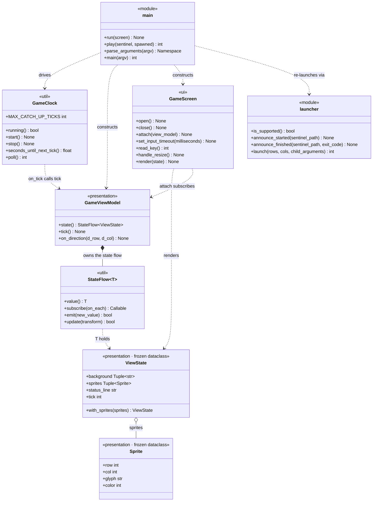

# Class Overview

The app's classes: a diagram carrying every public member, then each class's own
docstring. Generated from the source by walking the AST, so signatures and
docstrings are verbatim.

**Six classes** are covered: two frozen dataclasses and four that carry the
behaviour. The two exception types are deliberately left out.

The diagram carries the members. Each class entry below it is the class's own
docstring and nothing else — what the class is for, in the words of whoever
wrote it. For the signatures, read the diagram.

**Public members only.** Anything named with a leading underscore is omitted:
private fields, private methods, and private module constants.

The entry point and the window launcher are modules of plain functions rather
than classes. They are shown in the diagram as `<<module>>` boxes and tabulated
in their own section at the end, because leaving them out would hide how
everything is wired together.

## Diagram

The one-way flow the diagram encodes:

    GameClock --tick()--> GameViewModel --StateFlow<ViewState>--> GameScreen

`GameViewModel` never imports curses, and `GameScreen` never asks the ViewModel
for anything — it subscribes once and is pushed complete frames.

---

## `GameClock`

`terminalgame/util/clock.py`

> Calls `on_tick` once every `interval_seconds`, driven by poll().

---

## `StateFlow[T]`

`terminalgame/util/flow.py` — inherits `Generic[T]`

> Holds a current value and notifies subscribers when it changes.
>
> Mirrors StateFlow semantics:
> - always has a value (no "empty" state)
> - new subscribers immediately receive the current value
> - conflated / distinct-until-changed: emitting an equal value is a no-op

---

## `Sprite`

`terminalgame/presentation/state.py` — `@dataclass(frozen=True)`

> A single moving glyph drawn on top of the background.

---

## `ViewState`

`terminalgame/presentation/state.py` — `@dataclass(frozen=True)`

> One complete frame.
>
> `background` is the static maze; `sprites` are the things that move. They are
> separated only for clarity — GameScreen redraws both every frame and lets
> ncurses work out what actually changed.

---

## `GameViewModel`

`terminalgame/presentation/view_model.py`

> Turns ticks and key presses into ViewStates.

---

## `GameScreen`

`terminalgame/ui/screen.py`

> Owns the curses lifetime and paints ViewStates onto the terminal.

---

## Module constants — `terminalgame/presentation/state.py`

`Sprite.color` and `GameScreen` speak in these logical slots, so the ViewModel
never has to import curses.

| Signature | Description |
|---|---|
| `PLAYFIELD_ROWS = 30` | The fixed playfield height. The terminal window is resized to match at startup. |
| `PLAYFIELD_COLS = 80` | The fixed playfield width. |
| `COLOR_DEFAULT = 0` | No colour pair; drawn with `A_NORMAL`. |
| `COLOR_WALL = 1` | Mapped to blue by `GameScreen` when it opens. |
| `COLOR_PLAYER = 2` | Mapped to yellow. |
| `COLOR_GHOST = 3` | Mapped to red. |
| `COLOR_STATUS = 4` | Mapped to cyan. |

---

# Modules of functions

Neither of these is a class, but both are part of the app and appear in the
diagram above as `<<module>>` boxes.

## `terminalgame.app.main`

> Entry point.
>
>     python3 -m terminalgame.app.main           # opens the game in its own 30x80 window
>     python3 -m terminalgame.app.main --here    # runs in the current terminal instead
>
> Without --here the process re-launches itself inside a new Terminal.app window
> (see terminalgame/app/launcher.py), then blocks until the game exits and
> forwards its exit code, so it still behaves like an ordinary command.

### Constants

| Signature | Description |
|---|---|
| `TICK_INTERVAL_SECONDS = 0.15` | The simulation step. Roughly 1/7 s — fast enough for the ghost to read as moving rather than teleporting. |
| `INPUT_POLL_MILLISECONDS = 33` | How long `getch()` may block before the clock is checked again. This is input latency, not frame rate. |

### Functions

| Signature | Docstring |
|---|---|
| `run(screen: GameScreen) -> None` | — |
| `play(sentinel: str, spawned: bool) -> int` | Run the game in whatever terminal this process already owns. |
| `parse_arguments(argv)` | — |
| `main(argv=None) -> int` | — |

## `terminalgame.app.launcher`

> Spawns the game in its own correctly-sized Terminal.app window.
>
> Terminal.app's scripting interface exposes writable `number of rows` and
> `number of columns` on a tab, so the window is created at exactly 30x80 rather
> than being opened at the default size and resized afterwards — no visible snap.
> `tty` on the same tab is what lets us find the window we just made and close it
> again when the game exits.
>
> The launcher process stays alive in the original terminal, waiting on a
> sentinel file the game writes, so `python3 -m terminalgame.app.main` behaves
> like a normal blocking command and forwards the game's exit code.

### Constants

| Signature | Description |
|---|---|
| `STARTUP_TIMEOUT_SECONDS = 20.0` | How long to wait for the child to announce itself before assuming it never started. |
| `MAIN_MODULE = "terminalgame.app.main"` | The child is re-run as a module, so the project root — not the launcher's directory — is what the shell must `cd` to. |
| `WINDOW_TITLE = "Terminal Game"` | Shown in the title bar, in place of the internal command line. |
| `ENV_CHILD = "TERMINALGAME_CHILD"` | Set to `1` in the spawned child's environment. |
| `ENV_SENTINEL = "TERMINALGAME_SENTINEL"` | Path of the sentinel file the child writes. |
| `POLL_INTERVAL_SECONDS = 0.1` | Sentinel polling interval — a `stat()` on a local file, not an AppleScript call. |
| `CHILD_EXIT_TIMEOUT_SECONDS = 5.0` | Bounded wait for the child process to leave before touching its window. |

### Functions

| Signature | Docstring |
|---|---|
| `is_supported() -> bool` | True when we can drive Terminal.app on this machine. |
| `announce_started(sentinel_path: Optional[str]) -> None` | Called by the child once it is running, so the launcher can watch it. |
| `announce_finished(sentinel_path: Optional[str], exit_code: int) -> None` | Called by the child on the way out, cleanly or otherwise. |
| `launch(rows: int, cols: int, child_arguments: List[str]) -> int` | Open the game in a new window and block until it exits.  Returns the game's exit code. |

---

## A note on the dashes

Constants have no docstrings, so the **Description** column in the three
constants tables is drawn from the inline comment above the declaration where
one exists, and written from the code where one doesn't. A `—` in a
**Docstring** column means the function genuinely has none in the source.

Every class docstring above is reproduced word for word. A class whose entry
looks short has a short docstring, not a missing one.
