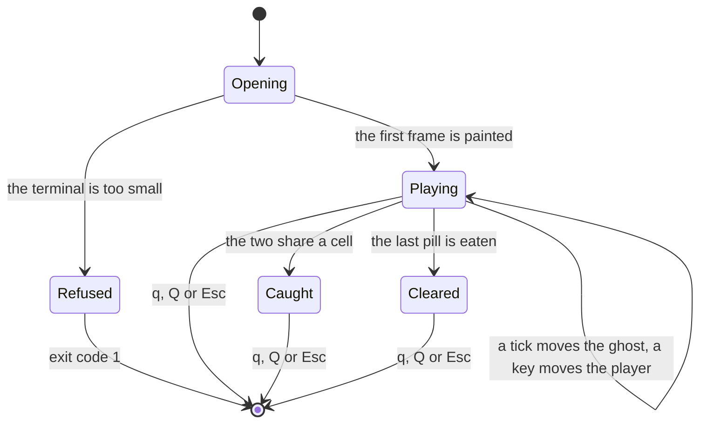

# How a game begins and ends

A run of this game has four ways to finish, and only two of them are the game
ending. The other two are the program declining to start and the player walking
away. They are worth seeing together, because each one is decided in a
different file, and the scenario documents each see only their own.

`Caught` and `Cleared` are the same state as far as the code is concerned — one
attribute, `_ending`, holding one of two words — and the same as far as the
player is concerned too, apart from what the status line says and the ghost
being drawn on top. Neither is an exit: a finished game sits there until the
player presses a quit key, and that is the only way out of it.

## The four endings, in one table

| Ending | Decided in | What the player sees | Exit code |
|---|---|---|---|
| **Refused** | `GameScreen.open`, before anything is drawn | A message on stderr saying what size was needed and what the terminal is. In a spawned window, a prompt holding it open long enough to read | 1 |
| **Caught** | `GameViewModel.tick` or `GameViewModel.on_direction` | The status line says so, and the ghost is drawn on top of the player | 0 |
| **Cleared** | `GameViewModel.on_direction`, when the last pill goes | The status line says so, with the score | 0 |
| **Quit** | The loop in `app/main.py` | The window closes | 0 |

Ctrl-C is a fifth way out and deliberately unremarkable: `play` catches
`KeyboardInterrupt` and passes, so it leaves exactly like a quit key, tidying
the terminal on the way through `__exit__`.

## Starting

`python3 -m terminalgame.app.main` does not normally play the game. It opens a
Terminal.app window of exactly the right size, starts a second copy of itself
inside it, and waits — which is
[the launcher scenario](scenarios/the-launcher-opens-the-game-in-its-own-terminal-window.md).
`--here` skips all of that and plays in the terminal you are already in.

Either way the game itself starts the same three steps:

1. `GameScreen.open` asks the terminal to resize itself to 30 by 40, takes it
   over, and measures what it actually got. A terminal that ignored the request
   and is still too small raises `TerminalTooSmall`, and nothing further
   happens — [that scenario](scenarios/a-terminal-too-small-to-hold-the-playfield-is-refused.md).
2. `GameViewModel()` carves a maze, places the player at the open cell nearest
   the middle and the ghost at the open cell furthest from the player, and
   builds frame one.
3. `screen.attach(view_model)` subscribes, and subscribing paints that first
   frame immediately — [that scenario](scenarios/the-first-frame-is-painted-when-the-screen-subscribes-to-the-view-model.md).

## Playing

Two things move, on two different schedules, and this is the part worth having
straight:

**The ghost moves on a tick.** Every 0.15 seconds `GameClock` fires
`GameViewModel.tick`, the ghost advances one cell, and a new frame is
published.

**The player moves on a key.** One arrow key is one whole cell. There is no
per-tick player movement and no held-key repeat beyond what the terminal's own
auto-repeat provides.

So the player's speed is however fast they press, and the ghost's is fixed.
Neither of them is chasing anything: the ghost carries straight on until the
cell ahead is wall, and only then picks at random from the ways out that are
not the way it came. It knows where the player is — the same object holds both
positions — and does nothing with it.

## The two endings inside the game

A capture can happen at either of two moments, and the code checks after both:
the ghost walking onto the player, in `tick`, and the player walking onto the
ghost, in `on_direction`. There is no need to look for the two swapping places,
which is the usual way a collision check is fooled — nothing here moves at the
same time as anything else, so a pass-through would take two moves and the
check runs after each of them.

Taking the last pill is checked in `on_direction` only, because the player is
the only one that eats. A player who takes the last pill off the cell the ghost
is standing on has still walked into the ghost: the capture is checked first,
and wins.

Once `_ending` is set, the game stops advancing. `tick` returns before it
increments anything, so the ghost stands still and the tick count stops.
`on_direction` returns before it moves anything, so the arrow keys do nothing.
No further frames are published, which means the last frame the player is
looking at stays on the terminal at no cost at all — nothing is being redrawn.

- [The ghost catches the player](scenarios/the-ghost-catches-the-player-and-the-game-ends.md)
- [The last pill is eaten](scenarios/the-last-pill-is-eaten-and-the-game-is-over.md)

## Leaving

`q`, `Q` and Esc all quit, and they are read by the loop in `app/main.py`
rather than by anything in `presentation` — the ViewModel has no concept of
quitting. The loop returns, the `with` block ends, `GameScreen.__exit__` runs
`close()`, and the terminal gets its echo, its caret and its line discipline
back. That happens whether the loop returned or threw:
[the quit scenario](scenarios/a-quit-key-ends-the-game-and-closes-the-window.md).

## What the launcher does with all this

The game's exit code has to get back to the terminal the player typed in, which
is a different process. The child writes it to the sentinel file — `exit 0` —
the launcher reads it, waits for the process to actually leave, closes the
window, and exits with the same code. So the two endings inside the game and
the two outside it all arrive at the shell as an ordinary exit status, and
`python3 -m terminalgame.app.main` behaves like any other command.

## Where to read next

- [The architecture](ARCHITECTURE.md) — which layer each of these decisions
  belongs to, and why the quit key is decided in `app` rather than in the
  ViewModel.
- [The scenario index](scenarios/SCENARIO_INDEX.md) — each transition above as
  a sequence diagram, with the messages between the parts.
- [The glossary](GLOSSARY.md) — tick, cell, sentinel, and the rest.
