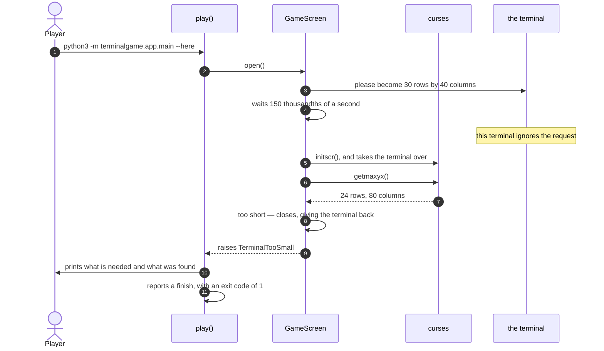

# A terminal too small to hold the playfield is refused

**Priority: `LOW`** — this happens only when something has already gone wrong, and on the ordinary way into the program it can barely happen at all, because the window is *created* at the right size rather than being found at it. It earns a document because it is the only path where the game gives up before drawing anything, and because giving up tidily is harder than it looks. [What the priorities mean](SCENARIO_INDEX.md#what-the-priorities-mean).

The game is started with `--here`, in a terminal window that is 24 rows by 80
columns. The playfield needs 30 rows by 40. The game asks the terminal to
resize itself, waits, measures, finds it has not been resized, and stops:

```
Need at least 30x40 (rows x cols); terminal is 24x80. Your terminal ignored
the resize request -- resize it by hand.
```

The command finishes with an exit code of 1, and the terminal the player typed
it into is untouched — echoing on, cursor visible, exactly as it was.

Two things about that are worth drawing out before the diagram.

**The size is asked for, not demanded.** There is a well-known instruction a
program can send a terminal to say "make yourself this many rows by this many
columns". Terminal.app honours it and so does iTerm2. Nothing obliges a
terminal to, and several do not — the instruction is a request with no reply,
so the only way to find out whether it worked is to send it, wait a moment,
and measure. That is exactly what the game does, and the
[moment it waits](../terminalgame/ui/screen.py#L52) is a tenth of a second and
a half, because a terminal resizes on its own schedule and not on the
program's.

**The terminal is handed back before the complaint is printed.** By the time
the size can be measured, curses[^curses] has already taken the terminal over:
echoing is off, the cursor is hidden. Printing a message into a terminal in
that state would produce something the player might not even see. So the
screen is closed first, restoring everything, and only then is the message
printed — into a terminal that is behaving normally again.

| Class | What it represents, and its part in this scenario |
|---|---|
| [`GameScreen`](../terminalgame/ui/screen.py#L59) | In this scenario it is the **inspector**, and the only part that ever knows the terminal's real size: [`open`](../terminalgame/ui/screen.py#L97) asks for the resize, measures what it got, restores the terminal and raises [`TerminalTooSmall`](../terminalgame/ui/screen.py#L55) |
| [`main`](../terminalgame/app/main.py) | In this scenario it is the **messenger**: [`play`](../terminalgame/app/main.py#L77) is the only place that catches this failure, and it decides both what the player is told and whether the window is held open long enough to read it |
| [`launcher`](../terminalgame/app/launcher.py) | Present only on the ordinary way in, where it is waiting on the same file it always waits on, and is told 1 instead of 0 |

## Asking, measuring, and giving up



| Step | Message | What is going on |
|---:|---|---|
| 1 | `python3 -m terminalgame.app.main --here` | The `--here` way in. On the ordinary way in the launcher opens a window *and sets its size*, so the size is right by construction and this scenario is nearly unreachable — nearly, because a font large enough that the window will not fit the display makes Terminal hand back fewer rows than were asked for, and then the same check catches it |
| 2 | [`open`](../terminalgame/ui/screen.py#L97)`()` | Everything below happens inside this one call. Until it returns, no picture exists and no view model has been built |
| 3 | please become 30 rows by 40 columns | [The instruction](../terminalgame/ui/screen.py#L50) is sent to the terminal directly, before curses is started. It is a request with no answer: nothing comes back to say whether it was understood, ignored, or refused |
| 4 | waits 150 thousandths of a second | A pause, because Terminal.app resizes a moment after being asked rather than immediately. Measuring straight away would find the old size and refuse a terminal that was about to be exactly right. Some terminals honour the request and some ignore it, and there is no way to tell which kind is on the other end except by measuring |
| 5 | `initscr()`, and takes the terminal over | Only now does curses start. From this line until the screen is closed, the terminal is in a state the player did not ask for: no echo, no cursor, keys delivered one at a time |
| 6 | `getmaxyx()` | The real size, as it actually is, after any resize that did happen |
| 7 | 24 rows, 80 columns | Tall enough in neither direction that matters: 24 rows against the 30 needed. The columns are more than enough, and are reported anyway, because "what you have" is more useful to a player than "what is wrong" |
| 8 | too short — closes, giving the terminal back | The screen is closed **before** the failure is raised, not by whoever catches it. The order matters and it is the point of this document: the message in step 11 is printed into a restored terminal, and a caller that forgot to tidy up cannot leave a terminal broken |
| 9 | raises [`TerminalTooSmall`](../terminalgame/ui/screen.py#L55) | A failure of its own kind rather than a general one, so the one place that knows what to do about it can catch exactly it and nothing else |
| 10 | prints what is needed and what was found | Both numbers, and a plain suggestion to resize by hand. It goes to the error stream rather than the ordinary one, so a player redirecting the game's output still sees it |
| 11 | reports a finish, with an exit code of 1 | The same report the game makes when it ends normally, from the same clause, carrying 1 instead of 0. Everything downstream — the launcher waking, the window closing, the exit code reaching the shell — happens exactly as it does for a game that was played and quit |

## The window that would close too fast to read

On the ordinary way in the message has a problem the `--here` path does not:
it is printed inside a window whose only purpose was to hold the game, and the
launcher closes that window as soon as the game finishes. The player would see
a window appear and vanish, with the explanation inside it.

So on that path only, the game
[waits for Return](../terminalgame/app/main.py#L109) before finishing. The
window stays, the message can be read, and closing it is the player's decision.
The game knows which path it is on because the launcher told it so in its
environment when it started it.

## Related scenarios

- [The launcher opens the game in its own Terminal window](the-launcher-opens-the-game-in-its-own-terminal-window.md)
  — where the window's size comes from on the ordinary way in, and why this
  failure is nearly unreachable there.
- [A quit key ends the game and closes the window](a-quit-key-ends-the-game-and-closes-the-window.md)
  — the same shutting-down path, taken after a game has been played rather
  than before one could start.
- [The first frame is painted when the screen subscribes to the view model](the-first-frame-is-painted-when-the-screen-subscribes-to-the-view-model.md)
  — what happens instead when the terminal is big enough.

### Footnotes

[^curses]: **curses** is a library included with Python for controlling a text
    terminal. Starting it changes the terminal in ways that outlast the
    program, which is why this scenario is careful about the order in which
    things are undone: the terminal is given back before anything is printed
    into it.
