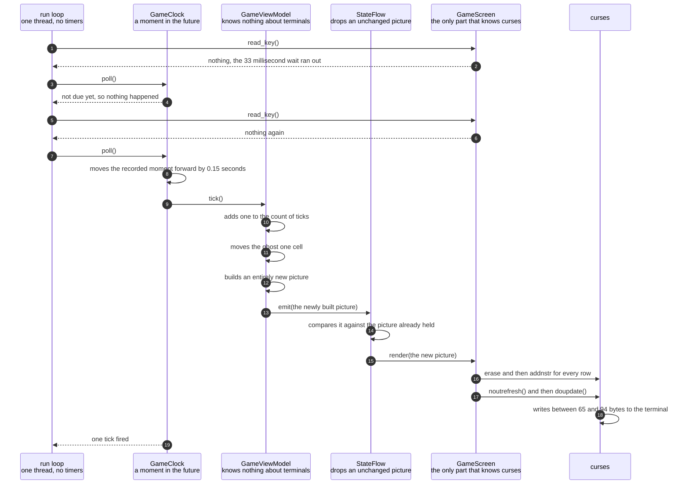

# A clock tick moves the ghost and repaints the screen

**Priority: `HIGH`** — this is the path every drawn frame after the first one takes. It runs several times a second for as long as the game is open. If it is wrong the ghost stops moving, or the picture stops arriving, and there is no other route by which either could happen. [What the priorities mean](SCENARIO_INDEX.md#what-the-priorities-mean).

Enough time has passed since the last tick. The ghost moves one column, the
count of ticks goes up by one, a new picture is built, and roughly forty-six
bytes reach the terminal. Then the game goes back to waiting for a key.

The value of this scenario is that it is the whole of the game's heartbeat. It
is also the clearest example of an idea that runs through the entire program:
the picture is always sent complete, never as a description of what changed.
Every tick builds a full picture, 30 rows by 40 columns, and hands it over as
one finished thing. That sounds wasteful. It is not, and the reason is
measurable rather than a matter of opinion. The work of finding what changed is
done one level lower down, by curses[^curses], which keeps its own copy of what
is currently on the screen. It compares the new picture against that copy and
sends instructions only for the character positions that genuinely differ.

There is a second idea in here, and it concerns what is **not** done. The game
does not use a timer that goes off by itself. A timer would arrive whenever it
felt like it, including in the middle of a picture being drawn, and curses
cannot survive that. So the clock has no life of its own. It is simply a
recorded moment in the future, and the main loop asks it, over and over,
"is it time yet". Everything in this document therefore happens on one thread,
in one order, with nothing interrupting it.

The two speeds involved are worth setting out plainly, because their
relationship explains the shape of the diagram. A tick is due every
[fifteen hundredths of a second](../../terminalgame/app/main.py#L28). Waiting for a
key gives up after
[thirty-three thousandths of a second](../../terminalgame/app/main.py#L32). Dividing
the first by the second gives about four and a half. So for roughly every four
or five times the loop goes round and asks, only one of them finds a tick
actually due. The other times cost nothing and are shown in the diagram, because
leaving them out would make the loop look far busier than it is.

| Class | What it represents, and its part in this scenario |
|---|---|
| [`main`](../../terminalgame/app/main.py) | The way into the program, and a module of plain functions rather than a class. In this scenario it is the **asker**: the loop inside [`_run`](../../terminalgame/app/main.py#L43) does nothing but read a key and then ask the clock whether a tick is due, round and round, forever. It never touches the terminal on this path |
| [`GameClock`](../../terminalgame/util/clock.py#L13) | A recorded moment in the future, and the rule for moving it forward. In this scenario it is the **timekeeper**: [`poll`](../../terminalgame/util/clock.py#L62) is the only thing that decides whether the game advances, and it only ever decides when it is asked |
| [`GameViewModel`](../../terminalgame/presentation/view_model.py#L226) | Everything the game knows about where things are and what has happened. In this scenario it is the **mover**: [`tick`](../../terminalgame/presentation/view_model.py#L278) advances the ghost and the count, then builds an entirely new picture rather than altering the old one |
| [`StateFlow`](../../terminalgame/util/flow.py#L13) | The carrier that holds the current picture. In this scenario it is the **gatekeeper**: [`emit`](../../terminalgame/util/flow.py#L56) compares the new picture against the one it is holding and passes it on only if they genuinely differ |
| [`GameScreen`](../../terminalgame/ui/screen.py#L59) | The only part of the program that knows anything about curses[^curses]. In this scenario it is the **painter**: [`render`](../../terminalgame/ui/screen.py#L234) is called because it subscribed once, long ago, and it has asked for nothing since |

## One tick becoming forty-six bytes

| Step | Message | What is going on |
|---:|---|---|
| 1 | [`read_key`](../../terminalgame/ui/screen.py#L218)`()` | The loop always reads a key first and asks about the clock second. The reading is what makes the loop pause rather than spinning at full speed and heating the machine up for nothing |
| 2 | nothing, the 33 millisecond wait ran out | No key was pressed. This is much the commonest outcome, since a player is not pressing a key most of the time. The waiting time was set once during startup and never changes |
| 3 | [`poll`](../../terminalgame/util/clock.py#L62)`()` | Asking the clock is deliberately cheap: it compares two numbers. The clock is asked on every single pass of the loop precisely because asking costs so little |
| 4 | not due yet, so nothing happened | The recorded moment is still in the future, so nothing at all is done and the answer is zero ticks. This is the ordinary result. With a tick due every fifteen hundredths of a second and the loop coming round about every thirty-three thousandths, roughly four out of every five passes end exactly here |
| 5 | [`read_key`](../../terminalgame/ui/screen.py#L218)`()` | Round again. The two wasted passes drawn here stand for however many there really are |
| 6 | nothing again | Still no key |
| 7 | [`poll`](../../terminalgame/util/clock.py#L62)`()` | The same cheap question, asked again |
| 8 | moves the recorded moment forward by 0.15 seconds | This time the moment has passed. Notice **how** it moves: the interval is added to the old moment, rather than the moment being set to now plus the interval. Those sound the same and are not. Setting it to now would push the moment slightly later every single time, because a little time always passes between the moment arriving and the program noticing. Over a long game the ghost would visibly slow down. Adding the interval to the old moment keeps the average exactly right |
| 9 | [`tick`](../../terminalgame/presentation/view_model.py#L278)`()` | This is the function the clock was handed when it was built. The clock has no idea what it does, and no idea that a game exists. It holds a function and calls it. That is the whole of the arrangement |
| 10 | adds one to the count of ticks | The count is shown in the line of readings under the arena, so it is a visible part of the picture rather than private bookkeeping. It is also what guarantees that every tick produces a genuinely different picture, which matters at the comparing step below |
| 11 | [moves the ghost one cell](../../terminalgame/presentation/view_model.py#L375) | The ghost carries straight on if the cell ahead is open. If it is not, the ghost picks at random from the open ways out that are not the way it came. It can always find one, and that is a direct consequence of the maze having no dead ends: a cell a ghost has just arrived at has at least two ways out, so one of them is not backwards. Reversing is a last resort the ghost reaches for only if something has gone wrong. It is the only thing in the game that moves without the player doing anything |
| 12 | [builds an entirely new picture](../../terminalgame/presentation/view_model.py#L431) | The new picture is built from scratch rather than the old one being altered. It can be built cheaply because the arena rows are reused rather than copied: the same rows are handed to every picture, since they never change. What is new each time is the pair of moving characters, the line of readings, and the tick number |
| 13 | [`emit`](../../terminalgame/util/flow.py#L56)`(the newly built picture)` | The new picture is offered to the carrier. The view model does not know or care whether anybody is listening. It has finished its work at this point |
| 14 | compares it against the picture already held | Pictures are frozen[^frozen], which makes comparing them a comparison of their contents rather than a question of whether they are the same object. If they matched, nothing further would happen and no bytes would reach the terminal. Running the program confirms that offering an identical value returns false and does not disturb anybody. On this path they never match, because the tick number has just changed |
| 15 | `render(the new picture)` | Nothing asked for this. The screen is called because it subscribed once during startup and has been registered ever since. There is no request here, no return value that matters, and no way for the screen to ask for a picture even if it wanted one |
| 16 | `erase` and then `addnstr` for every row | The whole picture is drawn again from nothing, all 29 arena rows and the line of readings, plus the two moving characters on top. No attempt is made to work out what changed, because the layer below does that better |
| 17 | `noutrefresh()` and then `doupdate()` | The first prepares the changes without sending anything. The second sends them all at once. Splitting it in two is what makes a frame arrive complete rather than in pieces |
| 18 | writes between 65 and 94 bytes to the terminal | Measured, not estimated. The game was run inside a false terminal of exactly 30 rows by 40 columns and the bytes written for each frame were counted. Steady frames ranged from 65 to 94. The range is wider than it looks: a ghost moving along a corridor rewrites two cells and the readings line, but it also has to switch colour between the pink of the sprite and the gold of the pill it uncovers, and how many colour changes a frame needs depends on what the ghost is moving past. Set that against the 10,657 bytes the very first picture costs, and against the 1,200 character positions the picture describes. Working out what changed by hand, inside the view model, could not do better |
| 19 | one tick fired | The count comes back to the loop, which ignores it. It exists so that this behaviour can be examined by a test without a terminal being involved anywhere |

This diagram has no coloured bands marking threads, and the absence is the whole
point of the design rather than an oversight. Every step above happens on one
thread, one after another. The clock does not run on its own, which is why it
has to be asked. The carrier calls those who registered an interest immediately,
in the same breath, rather than putting the picture in a queue for later. So the
complete journey from "the moment has passed" to "the bytes have been written"
happens inside a single call to [`poll`](../../terminalgame/util/clock.py#L62),
with nothing else able to run in between.

## What happens when the game has been asleep

A program can be stopped and started again by the person using the computer, or
by the whole machine going to sleep with the lid closed. When it wakes, the
recorded moment may be a very long way in the past.

Moving the moment forward by one interval at a time would then mean firing every
tick that was missed. An hour of sleep at fifteen hundredths of a second each
would be twenty-four thousand ticks, all fired one after another, before the
game responded to anything at all.

So [`poll`](../../terminalgame/util/clock.py#L62) fires at most
[three](../../terminalgame/util/clock.py#L22) ticks in one call. If the moment is
still in the past after those three, the backlog is abandoned and the moment is
reset to now plus one interval. The ghost is briefly in the wrong place, which
nobody can tell, and the game keeps responding, which everybody can.

## Related scenarios

- [The first frame is painted when the screen subscribes to the view model](the-first-frame-is-painted-when-the-screen-subscribes-to-the-view-model.md)
  — where the subscription used in this document was made, and why the first
  picture costs 10,657 bytes against this one's 65 to 94.
- [An arrow key moves the player and repaints the screen](an-arrow-key-moves-the-player-and-repaints-the-screen.md)
  — the other way a new picture is produced. It joins this path at the point
  where the picture is offered to the carrier, and it is the only route by which
  a player changes anything.
- [An unchanged frame is dropped before it reaches the terminal](an-unchanged-frame-is-dropped-before-it-reaches-the-terminal.md) — the other
  outcome of the comparing step, where the pictures match and nothing is drawn
  at all.

### Footnotes

[^curses]: **curses** is a library included with Python for controlling a text
    terminal: putting a character at a chosen row and column, choosing colours,
    and reading keys as they are pressed rather than a line at a time. The
    working part underneath it is a much older piece of software called
    ncurses. Its most useful trick is that it keeps its own copy of what is
    currently on the screen, compares that against what the program has just
    drawn, and sends instructions only for the character positions that
    actually differ.

[^frozen]: A **frozen** value is one that cannot be altered after it is made.
    If something different is wanted, an entirely new one is built. Both
    [`ViewState`](../../terminalgame/presentation/state.py#L68) and
    [`Sprite`](../../terminalgame/presentation/state.py#L45) are frozen. Two
    benefits follow, and this program relies on both. Two of them can be
    compared by their contents, which is what allows an unchanged picture to be
    recognised and dropped. And a picture handed to the drawing code can never
    be altered underneath it while it is being drawn, because nothing anywhere
    is able to alter one.
