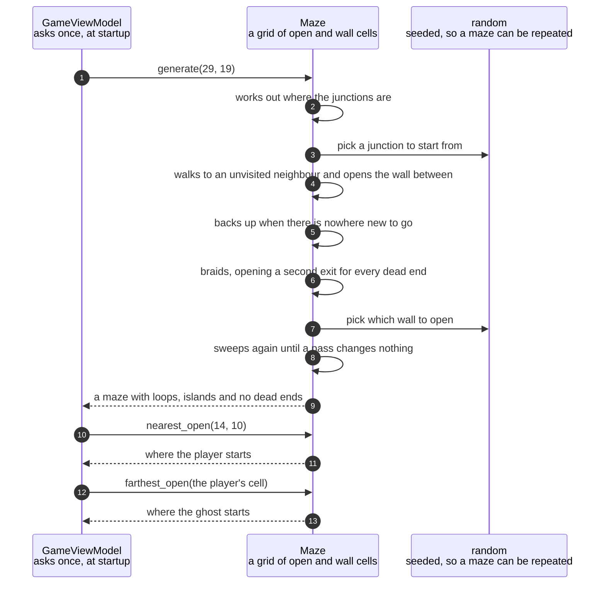

# A maze is carved and then braided until it has no dead ends

**Priority: `MEDIUM`** — this runs once for each game, and everything afterwards depends on the shape it produces. It is not on the path a drawn frame takes, so a fault here spoils a game rather than stopping the picture. [What the priorities mean](SCENARIO_INDEX.md#what-the-priorities-mean).

Before the first picture is drawn, the game decides what its playfield looks
like. It carves a random maze, and then it goes back over that maze and removes
every dead end.

The value of this scenario is that the maze is different every game and yet is
always playable. Two properties are guaranteed rather than hoped for. Every
corridor cell can be reached from every other, so no pill is ever stranded
somewhere the player cannot go. And no corridor ever comes to a stop, so
anything walking the maze always has somewhere to go that is not back the way
it came.

That second property is worth dwelling on, because it is doing more work than
it appears to. The ghost has no map and no plan. All it does is carry straight
on, and pick a new direction when it cannot. If the maze had dead ends, a ghost
that walked into one would have to turn round, and a ghost that turns round in
a corridor looks broken rather than deliberate. Removing the dead ends is what
lets the simplest possible ghost look purposeful.

The two passes do genuinely different jobs, and it helps to name them. The first
carves a **perfect** maze, which is a maze with exactly one route between any
two cells. That sounds like a good thing and is the opposite of what a game
wants: a maze with one route everywhere is a maze made almost entirely of dead
ends, because every branch that is not the way to somewhere has to stop. The
second pass, **braiding**, opens a second way out of every place that has only
one. It destroys the perfectness deliberately. What it leaves behind is a maze
with loops in it, and with solid blocks of wall that corridors run around.

![Three panels, each an eleven by eleven maze drawn as dark wall cells and white
corridors. In the first panel seven corridor cells are ringed in red: each is a
dead end, a corridor that goes somewhere and then stops. In the second panel the
same maze has seven wall cells filled amber, one opened next to each dead end,
and the corridors now join up into loops. In the third panel the same maze
again, with twenty-five of its wall cells shaded pale blue: these are the seven
islands, blocks of wall that no longer touch the
border.](../images/braiding-removes-dead-ends.svg)

*Hand-drawn, from a maze the code actually produced. Notice that the three
pictures are the same maze at three moments, not three different mazes. Every
retreat the carve makes leaves a dead end behind it, which is why the first
panel has so many. Braiding opens exactly one wall beside each. The islands in
the third panel were not sought out and are not chosen: they are simply the wall
that those openings happened to cut off from the border.*

| Class | What it represents, and its part in this scenario |
|---|---|
| [`GameViewModel`](../../terminalgame/presentation/view_model.py#L220) | Everything the game knows about where things are. In this scenario it is only the **customer**: it asks for a maze of a particular size during its own construction, and everything it does afterwards — placing the player and the ghost, deciding whether a move is allowed — is a question put to the maze it was given |
| [`Maze`](../../terminalgame/presentation/maze.py#L31) | A grid of cells, each either open corridor or wall. In this scenario it is the **maker and the judge at once**: [`generate`](../../terminalgame/presentation/maze.py#L60) carves and braids, and [`dead_ends`](../../terminalgame/presentation/maze.py#L190) and [`islands`](../../terminalgame/presentation/maze.py#L237) are how anybody checks what came out. It knows nothing about characters, colours or sprites, which is what lets it be built and examined without a terminal anywhere near it |

## Carving a perfect maze, then braiding its dead ends away



| Step | Message | What is going on |
|---:|---|---|
| 1 | [`generate`](../../terminalgame/presentation/maze.py#L60)`(29, 19)` | The playfield is 29 cells tall and 20 wide, but the maze asked for is 29 by **19**. A maze needs a wall cell on either side of every junction, so its border only comes out one cell thick when it is an odd number of cells across. Given an even number, the spare column has no junction to serve and ends up drawn as a second border running alongside the first. The size is passed in rather than read from the playfield, which is what lets a test build a small maze — an 11 by 11, say — instead of the game's |
| 2 | works out where the junctions are | A **junction** is a cell the maze can carve between: every second cell, starting one in from the edge. The cells in between are the walls that get opened. Thinking of the maze as junctions with walls between them, rather than as a picture, is what makes both passes simple |
| 3 | pick a junction to start from | Where the carve begins does not matter to the result, because the walk visits every junction before it finishes. It matters only in that it is random, so two games seeded differently start in different places |
| 4 | walks to an unvisited neighbour and opens the wall between | The carve proper. From where it stands, it looks at the junctions two cells away, picks one at random that it has not been to, opens the single wall cell separating the two, and moves there. This is a depth-first walk, so it drives on as far as it can before it ever turns back |
| 5 | backs up when there is nowhere new to go | When every neighbour has been visited it retreats one step and tries again from there. When it has retreated all the way back to the start, every junction has been visited exactly once. **Every one of those retreats has left a dead end behind it** — a corridor that goes somewhere and stops. That is not a flaw in the walk, it is what a perfect maze is |
| 6 | [braids](../../terminalgame/presentation/maze.py#L228), opening a second exit for every dead end | The second pass. A dead end is a junction with exactly one open neighbour, and the fix is to open a wall to a second one. Every junction has at least two neighbours, even one in a corner of the grid, so a second exit can always be found — which is what makes "no dead ends" a promise rather than an attempt |
| 7 | pick which wall to open | Which of the closed walls is opened is random, and that is where the maze gets its character. A different choice makes a different set of loops, and therefore a different set of solid islands, out of exactly the same carve |
| 8 | sweeps again until a pass changes nothing | Opening a wall raises the number of exits for **two** junctions at once, and never lowers one for anybody. So a junction that has been fixed stays fixed, and the sweep only has to repeat until it finds nothing left to do. There is no risk of it undoing its own work |
| 9 | a maze with loops, islands and no dead ends | The result was checked over 200 mazes built from different seeds: not one dead end anywhere, every open cell reachable from every other, and an average of 14 solid islands per maze. [`dead_ends`](../../terminalgame/presentation/maze.py#L190) hands back the offending cells rather than a yes or no, so when it does find something it says where |
| 10 | [`nearest_open`](../../terminalgame/presentation/maze.py#L269)`(14, 10)` | The player wants to start in the middle of the playfield, but the middle may well be wall. So the maze is asked for the nearest open cell instead. No fixed pair of coordinates could be promised open once the maze is random, which is why the starting positions are worked out rather than written down |
| 11 | where the player starts | An open cell, as close to the middle as the maze allows |
| 12 | [`farthest_open`](../../terminalgame/presentation/maze.py#L281)`(the player's cell)` | The ghost is placed as far from the player as the maze allows, so the two never start on top of each other or a step apart, whatever shape the carve happened to take |
| 13 | where the ghost starts | The open cell furthest from the player, measured by how many rows and columns apart they are |

This diagram has no coloured bands marking threads, and the absence is a
decision rather than an oversight. All of this happens on one thread, before
the game loop starts and before curses[^curses] has been told to draw anything.
By the time the first picture is painted the maze is finished and never changes
again.

## The islands, and why they hold no pills

An **island** is a block of wall that does not touch the border — the solid
shapes the corridors run around. They are a by-product of braiding: every wall
that gets opened to remove a dead end may leave a piece of wall no longer joined
to the outside.

Nothing goes looking for them in order to keep them empty. A pill is given to
every cell that was carved, and an island is made of cells that never were, so
an island is blank inside for the same reason a wall is: not because anything
decided it should be, but because nothing ever put anything there.

The maze can still be **asked** about them —
[`islands`](../../terminalgame/presentation/maze.py#L237) returns each one as a set
of cells — and that is used for checking rather than for drawing.

## Building a maze by hand

A maze can be made from lines of text rather than from a seed, which is what
lets anything be pinned down exactly instead of hunting for a seed that happens
to produce it:

```python
Maze.from_rows(["#####",
                "#...#",
                "#.#.#",
                "#...#",
                "#####"])
```

That one is a ring: eight open cells around a single-cell island, no dead ends,
fully connected. Asking a maze built this way for its
[`dead_ends`](../../terminalgame/presentation/maze.py#L190) is how anybody
establishes that the check works at all — a maze with a spur in it reports the
spur, so a report of nothing means nothing was there rather than that nothing
was looked for.

## Related scenarios

- [The first frame is painted when the screen subscribes to the view model](the-first-frame-is-painted-when-the-screen-subscribes-to-the-view-model.md)
  — what happens immediately after this, where the finished maze becomes the
  two layers of characters the screen draws.
- [A clock tick moves the ghost and repaints the screen](a-clock-tick-moves-the-ghost-and-repaints-the-screen.md)
  — where the absence of dead ends earns its keep, several times a second, for
  as long as the game is open.
- [An arrow key moves the player and repaints the screen](an-arrow-key-moves-the-player-and-repaints-the-screen.md)
  — the other thing that asks the maze a question: whether the cell a player is
  stepping into is open.

### Footnotes

[^curses]: **curses** is a library included with Python for controlling a text
    terminal: putting a character at a chosen row and column, choosing colours,
    and reading keys as they are pressed rather than a line at a time. The
    working part underneath it is a much older piece of software called
    ncurses. Its most useful trick is that it keeps its own copy of what is
    currently on the screen, compares that against what the program has just
    drawn, and sends instructions only for the character positions that
    actually differ.
