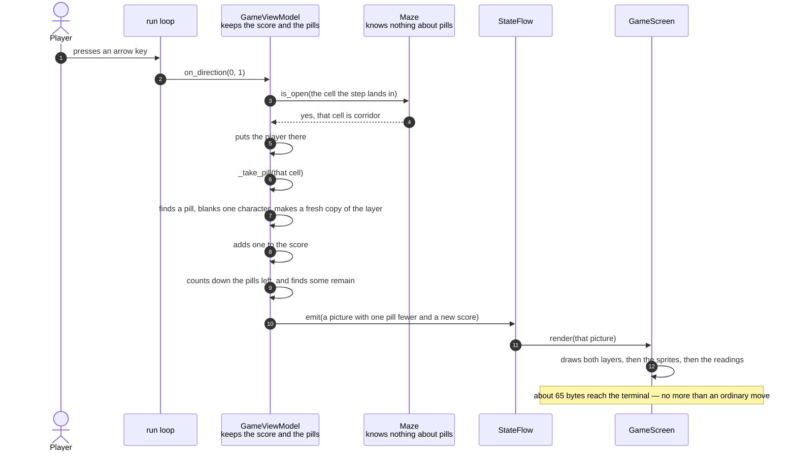

# A pill is eaten and the score goes up

**Priority: `MEDIUM`** — this happens only when a player presses a key, and only when the key press lands somewhere the player has not been before. The picture survives a fault here: the game still draws and can still be played. What is lost is the point of playing it. [What the priorities mean](SCENARIO_INDEX.md#what-the-priorities-mean).

A player presses an arrow key into a stretch of corridor they have not walked
yet. The character moves one cell, as it always does, and one more thing
happens on the way: the pill in that cell is taken, the score underneath the
arena[^arena] goes up by one, and the corridor behind the player stays blank
for the rest of the game.

This document is about that one extra step. Everything else in the story —
the key arriving, the direction being looked up, the picture being drawn — is
told in
[An arrow key moves the player and repaints the screen](an-arrow-key-moves-the-player-and-repaints-the-screen.md),
and is not repeated here.

The step is worth a document of its own because it is the first thing in the
program that **changes the arena itself**. Before it existed, the two layers
of the picture — the walls and the pills — were built once when the game
started and handed out unaltered for the rest of the run. The moving parts all
sat on top of them. Taking a pill means the arena is no longer a constant, and
the way that was arranged is the interesting part.

The pill layer is kept twice over. There is
[a list of rows](../../terminalgame/presentation/view_model.py#L260) that can be
edited, and there is the version handed out in pictures, which cannot be
altered by anyone. When a pill is taken, one character in the editable list is
replaced with a blank, and a fresh unalterable copy is made from it. That
copying happens **once for each pill**, not once for each picture: a game of
two hundred and sixty-odd pills makes two hundred and sixty-odd copies over
several minutes of play, which is nothing at all.

The obvious question is why one editable list would not do on its own. The
answer is that a picture is a **value**, not a window onto the view model.
[`StateFlow`](../../terminalgame/util/flow.py#L56) holds the last picture it
published and compares the next one against it, and that comparison is the
whole of how a repaint gets decided. What follows is a rule that reaches
further than pills: every value a
[`StateFlow`](../../terminalgame/util/flow.py#L13) emits has to be immutable,
and immutable all the way down — a frozen picture holding an editable list is
not a frozen picture.

Hand every picture the same editable list and the comparison stops comparing.
The pill layer of the picture being held and the pill layer of the picture
being offered are the *same object*, so they are equal whatever was blanked in
between, and a pill going could never be what makes a frame go out. Nothing is
visibly broken today, and only for a reason that is luck rather than design:
eating a pill always moves the player and raises the score in the same breath,
so something else in the picture differs and the frame is published anyway.
The layer would be relying on its neighbours to be noticed at all.

The second cost is quieter. The picture the flow is holding is the program's
record of what was last drawn. Share the list and that record rewrites itself
every time a pill is taken — ask it afterwards what the arena looked like when
the frame went out and it answers with the arena as it stands now. A picture
that changes after it has been published is not a picture of anything, and a
test that collects published frames and asserts on them would be asserting
about a moving target.

So the frozen[^frozen] copy is what a picture is made of, and the mutable list
is kept alongside it for one reason only: blanking a pill is a single indexed
assignment on a list, where the tuple of twenty-nine strings a picture carries
would have to be rebuilt around the one row that changed. The list is the
working copy. The tuple is what leaves the building.

Three details decide what a player actually sees, and none of them is
obvious.

**A pill is one character wide, not two.** A cell is two characters wide, and
the pill sits in the left one — the same column the walls draw their lines in,
and the column a sprite is centred on. So taking a pill is a single character
becoming a blank.

**The pill the player is standing on cannot be seen.** The character the
player controls is drawn over the whole cell, so the pill underneath it is
hidden whether it has been taken or not. A player only ever sees the result of
eating **after moving on**, which is why the cleared corridor reads as a trail
left behind rather than as something happening underfoot.

**The pill under the player at the start is taken silently.** The game places
the player on a corridor cell, and every corridor cell has a pill. That one is
[removed without scoring](../../terminalgame/presentation/view_model.py#L227),
which is why the opening score reads zero rather than one, and why a pill
nobody can see is never the last one the game is waiting for.

| Class | What it represents, and its part in this scenario |
|---|---|
| [`main`](../../terminalgame/app/main.py) | The way into the program. In this scenario it does nothing new: it turns a key into a direction, exactly as it does for any other move, and never learns that anything was eaten |
| [`GameViewModel`](../../terminalgame/presentation/view_model.py#L226) | Everything the game knows about where things are and what has been taken. In this scenario it is the **bookkeeper**: [`on_direction`](../../terminalgame/presentation/view_model.py#L285) moves the player, [`_take_pill`](../../terminalgame/presentation/view_model.py#L327) clears the cell if it still has a pill, and only then does the score go up |
| [`Maze`](../../terminalgame/presentation/maze.py#L31) | The shape of the arena. In this scenario it is the **gate**: [`is_open`](../../terminalgame/presentation/maze.py#L128) decides whether the move happens at all. It knows nothing about pills, and is never told one has gone |
| [`StateFlow`](../../terminalgame/util/flow.py#L13) | The carrier that holds the current picture, unchanged in its behaviour by any of this |
| [`GameScreen`](../../terminalgame/ui/screen.py#L59) | The painter. It is handed a picture whose pill layer differs from the last one by a single character, and it never has to be told that is what changed |

## One key press, one pill, one point

| Step | Message | What is going on |
|---:|---|---|
| 1 | presses an arrow key | Nothing here is specific to eating. The key is gathered, checked against the quit keys, and looked up in the table of directions, exactly as described in the [arrow key scenario](an-arrow-key-moves-the-player-and-repaints-the-screen.md) |
| 2 | [`on_direction`](../../terminalgame/presentation/view_model.py#L285)`(0, 1)` | A pair of numbers meaning "no change to the row, one more column". The view model[^viewmodel] still never learns that a key exists |
| 3 | `is_open(the cell the step lands in)` | The wall check comes **first**, before any question about pills. A step into wall is refused outright and nothing else in this document happens: no pill is taken, no score changes, nothing is published |
| 4 | yes, that cell is corridor | The maze answers about a cell, not a character position, and it has no idea whether that cell still has its pill. The two questions are kept apart on purpose: where the player may walk is a property of the maze, and what is left to collect is not |
| 5 | puts the player there | One whole cell, never a fraction of one |
| 6 | [`_take_pill`](../../terminalgame/presentation/view_model.py#L327)`(that cell)` | The cell is turned into a character position — the row as it stands, and the column doubled, because a cell is [two characters wide](../../terminalgame/presentation/state.py#L27) and the pill sits in the left one |
| 7 | finds a pill, blanks one character, makes a fresh copy of the layer | The character at that position is compared against [the pill mark](../../terminalgame/presentation/view_model.py#L49). If it is anything else — because the player has walked here before — the answer is no, and steps 8 and 9 do not happen. This is the whole of the rule that a corridor cannot be eaten twice |
| 8 | adds one to the score | One point per pill, and the score is only ever raised here. Nothing else in the program can change it |
| 9 | counts down the pills left, and finds some remain | The count is what decides whether the game is over, and it is covered in [The last pill is eaten and the game is over](the-last-pill-is-eaten-and-the-game-is-over.md). On this pass it simply goes down by one |
| 10 | [`emit`](../../terminalgame/util/flow.py#L56)`(a picture with one pill fewer and a new score)` | The new picture differs from the last one in two places: one character in the pill layer, and the score in the line of readings. It also differs in the sprite that moved, as any move does |
| 11 | `render(that picture)` | The screen was never told that a pill was eaten. It is handed a complete picture and draws it, and the layer underneath works out that a single character changed |
| 12 | about 65 bytes reach the terminal | Measured, not estimated, inside a false terminal of exactly 30 rows by 40 columns: a move that eats a pill cost 65 bytes and ordinary moves cost between 56 and 67. Eating is **free** in terms of what reaches the terminal, and the reason is step 6 — the pill was under the player's own character either way, so the same handful of positions had to be redrawn whether it was taken or not |

## Why the score cannot be counted from the picture

The score is kept as a number, and the pills remaining as another number,
rather than being counted out of the pill layer whenever they are needed.
Counting would work: the layer is a few hundred characters, and counting them
takes no time worth measuring.

The reason for keeping numbers is that the two questions have different
answers. **What is left on the arena** is what the layer holds. **What the
player has collected** is not, because the pill taken at the start was never
collected by anybody — it was removed to keep the arena honest. Counting the
layer would fold those two together and make the opening score read one.

## Related scenarios

- [An arrow key moves the player and repaints the screen](an-arrow-key-moves-the-player-and-repaints-the-screen.md)
  — the rest of this story. Everything except steps 6 to 9 is told there.
- [The last pill is eaten and the game is over](the-last-pill-is-eaten-and-the-game-is-over.md)
  — what happens on the one pass where step 9 counts down to nothing.
- [A clock tick moves the ghost and repaints the screen](a-clock-tick-moves-the-ghost-and-repaints-the-screen.md)
  — the other way a picture is produced. The ghost walks over pills without
  taking them: eating belongs to the player alone, and the ghost passes over a
  pill exactly as it passes over the player.

### Footnotes

[^arena]: The **arena** is the maze as it appears on screen: the walls and the
    pills together, filling the top 29 rows of the
    [playfield](../../terminalgame/presentation/state.py#L13) and leaving the
    last row for the line of readings. It is what the player and the ghost move
    *over*; they are drawn on top of it and are no part of it.

    It reaches the screen as two layers rather than one --
    [`walls` and `pills`](../../terminalgame/presentation/state.py#L88) -- each
    blank wherever the other has something, which is what lets a pill be a
    different colour from the walls it sits between.

    Until pills became something that could be taken, the arena was built once
    at startup and handed out unaltered for the rest of the run. Eating is the
    only thing in the program that changes it.

[^frozen]: A **frozen** value is one that cannot be altered after it is made.
    If something different is wanted, an entirely new one is built. Both
    [`ViewState`](../../terminalgame/presentation/state.py#L66) and
    [`Sprite`](../../terminalgame/presentation/state.py#L45) are frozen. Two
    benefits follow, and this program relies on both. Two of them can be
    compared by their contents, which is what allows an unchanged picture to be
    recognised and dropped. And a picture handed to the drawing code can never
    be altered underneath it while it is being drawn, because nothing anywhere
    is able to alter one.

[^viewmodel]: The **view model** is the part of the program that keeps track of
    what is happening in the game and turns that into pictures. It is
    [`GameViewModel`](../../terminalgame/presentation/view_model.py#L226). Since
    pills became something that can be taken, it also holds the score, the
    number of pills left, and whether the game has finished. It still draws
    nothing and still contains no mention of curses.
