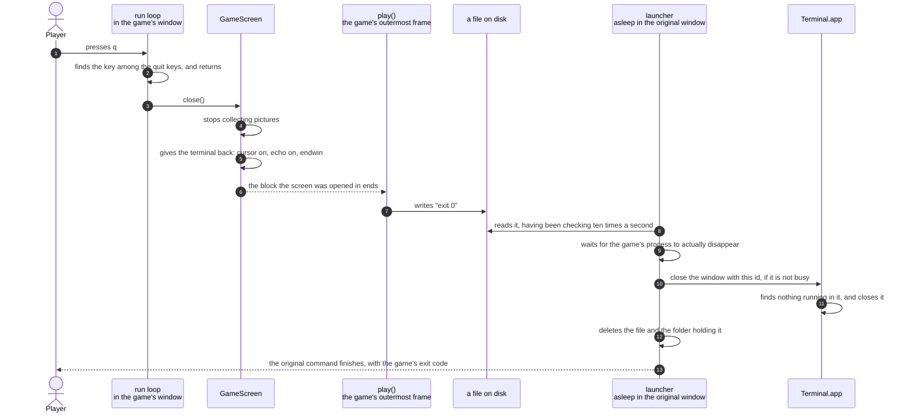

# A quit key ends the game and closes the window

**Priority: `MEDIUM`** — it happens once for each run of the program, at the end. A fault here does not spoil a single drawn frame, because by the time any of it runs the playing is over. What it spoils is everything afterwards: a terminal left in a state where typing shows nothing, a window that will not close, or a dialogue box asking the player to confirm something they did not ask for. [What the priorities mean](SCENARIO_INDEX.md#what-the-priorities-mean).

The player presses `q`. The window the game was playing in disappears, the
command they typed to start it finishes, and the terminal they typed it into is
exactly as they left it.

Three separate things have to happen in that order for this to work, and each
is owned by a different part of the program. The terminal has to be given back
before anything else, or the shell inherits a terminal with no echo and no
cursor. The launcher, which has been asleep in the original window since the
game started, has to be told that the game is finished. And the window has to
be closed at a moment when the operating system will close it silently instead
of asking a question.

The one that repays attention is the last. Terminal.app refuses to close a
window that is still running a program without asking the player to confirm it
— a dialogue box appears, and until somebody clicks it, every further
instruction to Terminal waits. So a launcher that asked for the window to be
closed one moment too early would hang, holding a dialogue nobody expected in
front of a game nobody is playing. Two separate guards make sure that cannot
happen, and they are described at steps 9 and 12.

| Class | What it represents, and its part in this scenario |
|---|---|
| [`main`](../../terminalgame/app/main.py) | The loop, and the game's own way out. In this scenario it is the **first to know**: [`_run`](../../terminalgame/app/main.py#L43) tests every key against the [quit keys](../../terminalgame/app/main.py#L40) before anything else and simply returns, and [`_play`](../../terminalgame/app/main.py#L77) makes sure the finish is reported however the game ended |
| [`GameScreen`](../../terminalgame/ui/screen.py#L59) | The part that borrowed the terminal. In this scenario it is the **restorer**: [`_close`](../../terminalgame/ui/screen.py#L127) stops collecting pictures, puts the cursor back, turns echoing back on, and hands the terminal over |
| [`launcher`](../../terminalgame/app/launcher.py) | The part waiting in the original window. In this scenario it is the **undertaker**: [`_wait_for_child`](../../terminalgame/app/launcher.py#L346) has been watching a file for the whole game, [`_wait_for_process_exit`](../../terminalgame/app/launcher.py#L384) waits for the game to be properly gone, and [`_close_window`](../../terminalgame/app/launcher.py#L432) asks for the window to be closed |
| Terminal.app | The program that owns the window. It is not part of this codebase and is spoken to in its own scripting language, one instruction at a time |

## Pressing q, and everything that follows

| Step | Message | What is going on |
|---:|---|---|
| 1 | presses `q` | The [quit keys](../../terminalgame/app/main.py#L40) are `q` and `Q`. Either does exactly what is described here |
| 2 | finds the key among the quit keys, and returns | The test comes **first**, before the key is looked up in the table of directions and before the view model is consulted. That ordering is deliberate: a player can always leave, even if everything downstream of this point were broken. Returning from the loop is the entire mechanism — there is no flag, and nothing is asked to stop |
| 3 | [`_close`](../../terminalgame/ui/screen.py#L127)`()` | Not called by the loop. The screen was opened inside a block that guarantees it is closed on the way out, however the way out is reached — a return, an error, or an interruption from the keyboard |
| 4 | stops collecting pictures | The registration made at startup is undone first, before the terminal is touched. The order matters: were a picture to arrive after the terminal had been handed back, it would be drawn into a terminal the game no longer owns |
| 5 | gives the terminal back: cursor on, echo on, endwin | Everything borrowed is returned in the opposite order to the borrowing. The cursor is made visible, keys are echoed again, the keypad translation is switched off, and curses[^curses] is shut down. Without this the player's shell would come back with an invisible cursor and no echo of what they type — a terminal that looks broken |
| 6 | the block the screen was opened in ends | Control is back in [`_play`](../../terminalgame/app/main.py#L77), which is the outermost part of the game itself |
| 7 | writes `exit 0` | Written to a small file whose name was handed to the game in its environment when it was started. It is written from a clause that runs whether the game ended well or badly, so a game that crashed still reports a finish rather than leaving the launcher waiting. The file is written under a temporary name and then renamed, so the launcher can never read half of it |
| 8 | reads it, having been checking ten times a second | The launcher has been asleep in the original window for the whole game, waking [ten times a second](../../terminalgame/app/launcher.py#L68) to look at one small file. It watches a file rather than asking Terminal.app anything, which is why a game in progress costs two instructions to Terminal in total: one to open the window and one to close it |
| 9 | waits for the game's process to actually disappear | **The first guard.** The exit code is written before the game's process has finished unwinding, so at this moment the game has announced its finish but is still running. Asking for the window to be closed now is exactly what produces the confirmation dialogue. So the launcher waits — bounded, up to five seconds — for the process to be gone |
| 10 | close the window with this id, if it is not busy | The window is identified by an id captured when it was opened, not by its title. Titles are unreliable here: Terminal puts the running command in the window's name, and the window running the launcher itself can match a search for the game |
| 11 | finds nothing running in it, and closes it | The command run in the window was arranged so that Python **replaces** the shell rather than running underneath it. When the game exits there is no shell left either, so the window has nothing running in it at all, and Terminal closes it without asking anybody anything |
| 12 | deletes the file and the folder holding it | **The second guard** is in the same instruction as step 10 rather than being a step of its own: the script asks Terminal whether the window is busy and closes it only if it is not. The waiting at step 9 is what normally makes that true; the check is what makes it safe when the waiting was not enough |
| 13 | the original command finishes, with the game's exit code | The launcher returns the code the game reported, so `python3 -m terminalgame.app.main` behaves like any ordinary command: it blocks while the game runs, and finishes with the game's own result |

## What happens if the player closes the window instead

A player can close the game's window with the mouse rather than pressing `q`,
and the launcher survives it. Along with its exit code, the game
[records its process id](../../terminalgame/app/launcher.py#L166) in the same file
at startup — which is why the file is written twice rather than once. So on
every pass of its waiting loop the launcher can ask a second question: is that
process still there? A window closed by hand takes the game with it, the answer
becomes no, and the launcher stops waiting for an exit code that is never
coming.

## Related scenarios

- [The launcher opens the game in its own Terminal window](the-launcher-opens-the-game-in-its-own-terminal-window.md)
  — the other half of this story, and where the window id, the file and the
  waiting all come from.
- [The last pill is eaten and the game is over](the-last-pill-is-eaten-and-the-game-is-over.md)
  — the state a player is often in when they press `q`. The two are entirely
  independent: quitting works identically before and after the game has ended.
- [A terminal too small to hold the playfield is refused](a-terminal-too-small-to-hold-the-playfield-is-refused.md)
  — the same shutting-down path, reached without a single frame ever being
  drawn.

### Footnotes

[^curses]: **curses** is a library included with Python for controlling a text
    terminal. Taking control of a terminal changes it in ways that outlast the
    program: echoing of typed characters is switched off, the cursor is
    hidden, and keys are delivered one at a time rather than a line at a time.
    Handing it back is not a courtesy but a requirement, which is why it is
    done from a block that runs even when the game ends badly.
