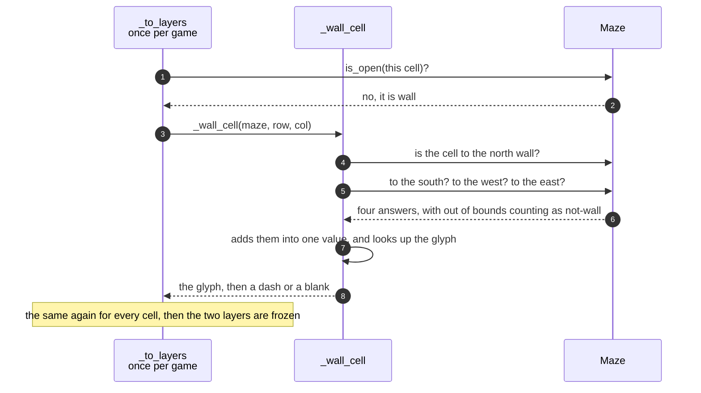

# A wall cell chooses its box-drawing glyph from its neighbours

**Priority: `LOW`** — it runs once for each game, while the maze is being turned into the two layers a picture is drawn from, and never again. A fault here cannot stop the game being played: the corridors are where they were, the walls block what they blocked. What it spoils is the reading of it — corners that do not close, lines that stop short of each other, and a picture that looks like a diagram of a maze rather than a maze. [What the priorities mean](SCENARIO_INDEX.md#what-the-priorities-mean).

The maze knows only which cells are open and which are wall. It has no idea
what a corner is. Yet the picture has corners, tees, crossings and lone
pillars, all meeting each other exactly, and every one of them is chosen by a
single cell asking four questions about its neighbours.


### Step through it yourself

[**Every wall cell picks its glyph, one at a time**](../wall-glyphs-step-by-step.html)
sets the panels above in motion. It opens on an eleven by eleven maze in the only
state the maze itself understands — every wall cell a solid block, because open
or not open is the whole of what it knows — and then walks the arena cell by
cell, in the order
[`_to_layers`](../../terminalgame/presentation/view_model.py#L191) walks it.

Each wall cell asks its four questions in front of you. The four cells around it
are badged with the numbers they would contribute, the ones that are wall light
up and the ones that are not stay dim, the total is added, and the solid block
turns into the line that total chose. Corridor cells take a pill instead, so both
layers fill in together and you can see that each is blank wherever the other has
something.

Watch the corners of row 0 in particular. They close into a rectangle only
because the cells off the edge count as not-wall — the rule that is hardest to
see the point of until you watch it apply.

The glyph table is [`_WALL_GLYPH`](../../terminalgame/presentation/view_model.py#L70)
and the walk is the one the code makes. The maze comes from the same seeded
Mersenne Twister the [maze walkthrough](../maze-step-by-step.html) uses, so **seed
7 is the same maze in both pages**, and both layers were checked against
`_to_layers` for seeds 7, 0 and 42, character for character.

**On opening it.** GitHub renders Markdown with scripts stripped out, so an
interactive example cannot live inside this document; it has to be its own HTML
file alongside it. It is live at
[replicant1.github.io/TerminalGame/docs/wall-glyphs-step-by-step.html](https://replicant1.github.io/TerminalGame/docs/wall-glyphs-step-by-step.html),
and opens straight from a clone as well — one file, no build step, no
dependencies, no network access.

## The four questions

A wall cell asks whether the cell to its north, south, west and east is also
wall. Each answer that is yes contributes a number — 1, 2, 4 and 8 — and the
four add up to one value between 0 and 15. That value chooses the glyph from
[a table of sixteen](../../terminalgame/presentation/view_model.py#L64).

Two decisions in those questions are worth stating, because both are what makes
the border of the maze come out as a rectangle rather than a fringe.

**Out of bounds counts as not-wall.** A cell on the very edge of the playfield
has neighbours that do not exist, and treating them as wall would give the
border arms pointing off the edge of the picture. Treating them as open closes
the border into a rectangle.

**A cell with one arm is drawn as the run, not as a stub.** A wall cell whose
only wall neighbour is to the east is drawn as a full horizontal line, not as
half of one. The single-line box characters have half-lines available; the
double-line set this game uses has none at all, so there is nothing else the
cell could be. It reads as a run that continues past the edge of what is drawn,
which is what it is.

Lines are double rather than single because at this size they carry more weight
than the single-line set — which matters where a wall is one cell thick and has
pills either side of it.

| Value | The wall neighbours | The glyph | Reads as |
|---:|---|:---:|---|
| 0 | none | `■` | a pillar: a lone wall cell with nothing to join |
| 1, 2, 3 | north and/or south | `║` | a run going down |
| 4, 8, 12 | west and/or east | `═` | a run going across |
| 5, 9, 6, 10 | one vertical, one horizontal | `╚ ╝ ╔ ╗` | the four corners |
| 7, 11, 13, 14 | three sides | `╠ ╣ ╦ ╩` | a tee |
| 15 | all four | `╬` | a crossing |

The pillar is the interesting one. It is not a decoration: it is what a
one-cell island of wall looks like, and those islands are made by the braiding
pass that removes dead ends, described in
[A maze is carved and then braided](a-maze-is-carved-and-then-braided-until-it-has-no-dead-ends.md).
It is drawn as a filled square, deliberately larger than a pill, so that a lone
wall and a thing to collect can never be mistaken for one another.

## The other half of the cell

A cell is two characters wide, and everything above chooses the **left** one.
That is the centre line the whole picture shares: vertical runs line up in it,
sprites are centred on it, and pills sit in it. There is no column between the
two halves for a vertical line to occupy, so there is nowhere else it could be.

The right-hand character has a rule of its own, and only one:

```
it carries ═ when this cell's wall continues east, and stays blank otherwise
```

Filling it in any other case would leave a wall touching the pill in the next
cell along, with none of the gap every other wall cell leaves. That single
character is the difference between corridors that read as corridors and a
picture where the walls and the pills are jammed together.

| Class | What it represents, and its part in this scenario |
|---|---|
| [`Maze`](../../terminalgame/presentation/maze.py#L31) | The shape, and the only source of truth. In this scenario it is the **oracle**: [`is_open`](../../terminalgame/presentation/maze.py#L128) answers the four questions and treats anything off the grid as not-wall |
| [`_wall_cell`](../../terminalgame/presentation/view_model.py#L149) | The chooser. It is a plain function rather than a method because it is a lookup and nothing more: four questions in, two characters out, no state |
| [`_to_layers`](../../terminalgame/presentation/view_model.py#L191) | The pass that walks every cell of the maze once, calling the chooser for the wall cells and putting a pill in the open ones, and hands back the two layers a picture is made of |

## Turning a maze into a wall layer



| Step | Message | What is going on |
|---:|---|---|
| 1 | `is_open(this cell)?` | Every cell of the maze is visited once, in reading order. This question decides which of the two layers gets something and which gets blanks |
| 2 | no, it is wall | An open cell takes the other branch: it gets a pill in the pill layer and blanks in the wall layer. A wall cell gets the opposite, which is why the solid islands come out blank inside without anything having to go looking for them |
| 3 | [`_wall_cell`](../../terminalgame/presentation/view_model.py#L149)`(maze, row, col)` | The maze is passed in rather than remembered. The function holds nothing between calls, which is what lets a single cell's glyph be worked out and checked on its own |
| 4 | is the cell to the north wall? | The first of four separate questions to the maze, each of which may fall outside the grid |
| 5 | to the south? to the west? to the east? | The other three, asked the same way. Nothing is cached and nothing is shared between cells: a cell's glyph depends on nothing but the four answers it gets |
| 6 | four answers, with out of bounds counting as not-wall | The rule that closes the border. It is expressed once, inside the asking, so no caller has to remember it |
| 7 | adds them into one value, and looks up the glyph | The four answers become one number, and the number becomes a character from the table of sixteen. There is no branching on shape anywhere: no code asks "is this a corner" |
| 8 | the glyph, then a dash or a blank | Two characters, always. The second is decided by the east answer alone, which was already gathered for the first. The same happens for every cell -- roughly five hundred and fifty of them in a 29 by 19 maze, each a handful of lookups, all of it once per game and none of it while anything is being drawn |

## Related scenarios

- [A maze is carved and then braided until it has no dead ends](a-maze-is-carved-and-then-braided-until-it-has-no-dead-ends.md)
  — where the shape being drawn comes from, and where the islands that become
  pillars are made.
- [The first frame is painted when the screen subscribes to the view model](the-first-frame-is-painted-when-the-screen-subscribes-to-the-view-model.md)
  — what happens to the two layers this scenario produces.
- [A pill is eaten and the score goes up](a-pill-is-eaten-and-the-score-goes-up.md)
  — the other layer, and the one that stopped being fixed for the game.
