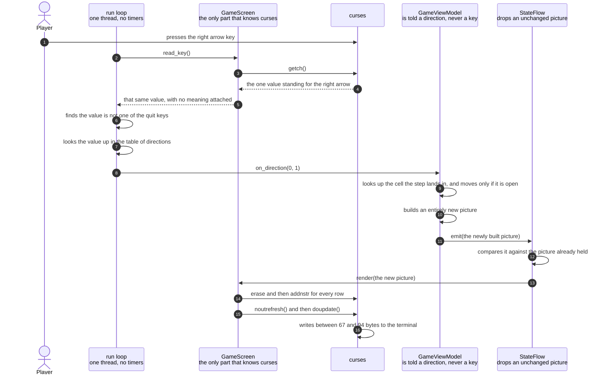

# An arrow key moves the player and repaints the screen

**Priority: `HIGH`** — this is the only route by which a player can change anything the game does. Every other moving part runs on its own without being asked. If this collaboration is wrong the game still draws, and the ghost still paces, but nobody can play it. [What the priorities mean](SCENARIO_INDEX.md#what-the-priorities-mean).

A player presses the right arrow key. The character they control moves one
column to the right, the line of readings underneath the arena updates to show
its new position, and forty-seven bytes reach the terminal. All of that happens
before the game asks its clock anything at all.

The value of this scenario is the feeling of the game responding at once. That
is not a happy accident, and it is worth being precise about what produces it.
A key press does **not** wait for the next beat of the clock. It is handled the
moment it arrives, and the new picture is drawn immediately, on the same trip
round the loop. If key presses were instead stored up and dealt with on the next
beat, a player could wait as long as fifteen hundredths of a second to see their
own move. That is short, but it is long enough to feel like the game is
sluggish. The longest a player can actually wait here is
[thirty-three thousandths of a second](../../terminalgame/app/main.py#L32), which
is how long the game is prepared to sit waiting for a key before it goes off to
check the clock instead.

There is a firm rule about who is allowed to know what, and this scenario shows
it more clearly than any other. The view model[^viewmodel] is told **a
direction**, not a key. It is given a pair of numbers meaning "no change to the
row, one more column". It never learns that an arrow key exists, and it could
not tell a key press apart from any other source of movement. Meanwhile the
screen, which is the part that knows what keys are, never learns what the key
*means*. It hands back a plain number and stops there. The only place in the
program where a key is turned into a direction is a small table in the way-in
module, and that table is the entire vocabulary of the game's controls.

One more detail is worth stating before the diagram. The player's new position
is not simply the old position plus one. The cell the step would land in is
looked up in the maze first, and if it is wall the press does nothing at all —
the player does not slide, stop short, or edge partway in. Without that check
the maze would be decorative: a player could walk straight through a wall, and
the whole point of carving corridors would be lost.

| Class | What it represents, and its part in this scenario |
|---|---|
| [`main`](../../terminalgame/app/main.py) | The way into the program, and a module of plain functions rather than a class. In this scenario it is the **translator**: the loop inside [`run`](../../terminalgame/app/main.py#L43) is the only place a key is turned into a direction, and the only place that knows which keys mean quit and which mean move |
| [`GameScreen`](../../terminalgame/ui/screen.py#L59) | The only part of the program that knows anything about curses[^curses]. In this scenario it does two separate jobs at opposite ends of the story. First it is the **ear**: [`read_key`](../../terminalgame/ui/screen.py#L218) hands back one plain number and attaches no meaning to it. Later it is the **painter**: [`render`](../../terminalgame/ui/screen.py#L234) draws the finished picture, and it is called without having asked for anything |
| [`GameViewModel`](../../terminalgame/presentation/view_model.py#L226) | Everything the game knows about where things are. In this scenario it is the **mover**: [`on_direction`](../../terminalgame/presentation/view_model.py#L285) applies the step, keeps the result inside the walls, and builds an entirely new picture. It is told a direction and never learns what caused it |
| [`StateFlow`](../../terminalgame/util/flow.py#L13) | The carrier that holds the current picture. In this scenario it is the **gatekeeper**, and it matters more here than on any other path: [`emit`](../../terminalgame/util/flow.py#L44) compares the new picture against the one it holds, and a player pressing into a wall produces a picture identical to the one already on screen |

## A key press becoming a moved character, without waiting for the clock

| Step | Message | What is going on |
|---:|---|---|
| 1 | presses the right arrow key | An arrow key does not arrive as a single character. It arrives as a short run of several characters in a row, called an escape sequence[^escape]. The terminal sends that run, and curses[^curses] is what gathers it up. This was arranged during startup, by asking curses to recognise these runs, and it is the reason no part of this program ever has to decode one |
| 2 | [`read_key`](../../terminalgame/ui/screen.py#L218)`()` | The loop asks for a key on every single pass. Most of the time there is nothing to collect, and the answer is nothing at all. This particular pass is one of the rare ones where a player has actually pressed something |
| 3 | `getch()` | The underlying request for a key. It has been told to give up after a set time rather than waiting forever, which is what allows the loop to go and check the clock when no key is pressed. Here the key is already waiting, so it comes back at once |
| 4 | the one value standing for the right arrow | The several characters the terminal sent have been gathered into a single number. That number is not the code for any printable character. It is a value curses reserves for this particular key, so that an arrow can never be confused with something a player typed |
| 5 | that same value, with no meaning attached | The screen passes the number straight through. It does not know that the game has a player character, or that anything moves. This is the whole extent of the screen's involvement in the story until the very last part |
| 6 | finds the value is not one of the quit keys | The first thing checked, before anything else, is whether the game should stop. The [quit keys](../../terminalgame/app/main.py#L40) are the letter q in either capital or small form, and the escape key. Testing for quit first means a player can always leave, even if every other check that follows were somehow broken |
| 7 | looks the value up in the table of directions | The [table of directions](../../terminalgame/app/main.py#L34) has exactly four entries, one for each arrow, and each holds a pair of numbers: how much to change the row by, and how much to change the column by. This table is the complete vocabulary of the game's controls. A key that is in neither this table nor the quit keys is quietly ignored, which is why typing an ordinary letter during the game does nothing and disturbs nothing |
| 8 | [`on_direction`](../../terminalgame/presentation/view_model.py#L285)`(0, 1)` | **This is the moment the key stops being a key.** What crosses over is the pair of numbers zero and one, meaning no change to the row and one more column. The view model[^viewmodel] is never told which key was pressed, or that a key was pressed at all. The same call could just as easily come from a test, or later from a game controller, and nothing on the far side would need changing |
| 9 | looks up the cell the step lands in, and moves only if it is open | The maze is asked, and it answers about a **cell** rather than a character position. If the cell is wall, nothing happens: no move, no new picture, and not a single byte to the terminal. That is why a player holding an arrow key against a wall costs nothing at all. If it is open, the player is simply put there — there is no clamping to the playfield[^playfield]'s edges, because the border is itself wall and the same check stops the player at it |
| 10 | builds an entirely new picture | Exactly the same kind of picture the clock's beat produces. Note what has **not** changed: the count of ticks stays where it was, and the ghost has not moved, because neither of those has anything to do with a key being pressed. What has changed is the player's position, and the line of readings underneath the arena, which shows that position in words |
| 11 | [`emit`](../../terminalgame/util/flow.py#L44)`(the newly built picture)` | The new picture is offered to the carrier. The view model has finished. It does not know whether anybody is listening, and it never finds out whether the picture was drawn |
| 12 | compares it against the picture already held | This comparison earns its keep here more than anywhere else in the program. Pictures are frozen[^frozen], so comparing two of them compares their contents. On the clock's path the pictures always differ, because the count of ticks has just gone up. On this path they can easily be identical: a player pressing into a wall changes nothing at all, and running the program confirms that no new picture is published when that happens |
| 13 | `render(the new picture)` | Nothing asked for this. The screen is called because it registered an interest once during startup, and it has been registered ever since. This is the second and last part the screen plays, and it is at the opposite end of the story from handing over the key |
| 14 | `erase` and then `addnstr` for every row | The whole picture is drawn again, all 29 arena rows and the line of readings, with the two moving characters placed on top. No attempt is made to work out that only one character moved, because the layer underneath does that job better |
| 15 | `noutrefresh()` and then `doupdate()` | The first prepares the changes without sending anything. The second sends them all at once, in a single write, so the picture cannot be caught half drawn |
| 16 | writes between 67 and 94 bytes to the terminal | Measured, not estimated. The game was run inside a false terminal of exactly 30 rows by 40 columns, arrow keys were sent to it, and the bytes written in response to each were counted. The work is small: put the pill back where the player used to stand, draw the player in its new cell, and rewrite the part of the readings line that names the position. The range comes from colour — the player is bright yellow, the pill under it gold, and how many times a frame has to switch colour depends on what the player is moving past. Some measured bursts came to 94 bytes because a clock repaint landed too close to tell apart |

This diagram has no coloured bands marking threads, and the absence is a
decision rather than an oversight. Everything above happens on one thread, one
step after another. It is worth noticing what is missing from the end of the
diagram: there is no message to the clock anywhere in it. Once the picture has
been drawn, the loop does go on to ask the clock whether a beat is due, exactly
as it does on every pass. But by then the player has already seen their
character move. The drawing did not wait for the clock, and the clock had no
part in it.

## Holding a key down

Terminals repeat a held key automatically, so holding an arrow down produces a
stream of separate key presses rather than one long one. Each is handled exactly
as the diagram shows, one after another, and each draws its own picture.

Two things keep that from becoming a problem. The character stops at the wall
rather than running past it, because a step into wall is refused outright. And
because the position never changes, no new picture is even built: the press
returns without publishing anything. So a player leaning on an arrow key
against a wall costs the terminal nothing at all — not one byte.

## Related scenarios

- [A clock tick moves the ghost and repaints the screen](a-clock-tick-moves-the-ghost-and-repaints-the-screen.md)
  — the other way a new picture is produced. The two paths join at the point
  where the picture is offered to the carrier, and are identical from there on.
  The difference is that a tick always changes something and a key press need
  not.
- [The first frame is painted when the screen subscribes to the view model](the-first-frame-is-painted-when-the-screen-subscribes-to-the-view-model.md)
  — where the registration used in this document was made, and where the game
  was told how long to wait for a key before giving up.
- [An unchanged frame is dropped before it reaches the terminal](an-unchanged-frame-is-dropped-before-it-reaches-the-terminal.md) — the other
  outcome of the comparing step, which this path reaches whenever a player
  presses into a wall.

### Footnotes

[^viewmodel]: The **view model** is the part of the program that keeps track of
    what is happening in the game and turns that into pictures. It holds where
    the player is, where the ghost is, and how many ticks have passed. It is
    [`GameViewModel`](../../terminalgame/presentation/view_model.py#L226). It never
    draws anything and contains no mention of curses[^curses] at all, which is
    what allows it to be read and tested without a terminal being involved.

[^curses]: **curses** is a library included with Python for controlling a text
    terminal: putting a character at a chosen row and column, choosing colours,
    and reading keys as they are pressed rather than a line at a time. The
    working part underneath it is a much older piece of software called
    ncurses. Its most useful trick is that it keeps its own copy of what is
    currently on the screen, compares that against what the program has just
    drawn, and sends instructions only for the character positions that
    actually differ.

[^escape]: An **escape sequence** is a short run of several characters in a row
    that stands for one thing which is not a printable character. The run
    always begins with the escape character, which is where the name comes
    from. Terminals use them in both directions. Going out, a program sends one
    to say something like "move to this row and column" or "draw in red".
    Coming in, the terminal sends one to say which arrow key was pressed, since
    there is no single character meaning "the right arrow".

[^playfield]: The **playfield** is the fixed rectangle of character positions
    the game draws into: 30 rows tall and 40 columns wide, set by
    [`PLAYFIELD_ROWS`](../../terminalgame/presentation/state.py#L13) and
    [`PLAYFIELD_COLS`](../../terminalgame/presentation/state.py#L14). The top 29
    rows hold the maze. The last row holds a line of readings showing the tick
    number and where the player is.

    The game itself thinks in **cells** rather than characters. A cell is
    [one row by two columns](../../terminalgame/presentation/state.py#L26), which
    is very nearly square because a terminal's character is about twice as tall
    as it is wide. That makes the playfield 29 cells tall and 20 wide.

[^frozen]: A **frozen** value is one that cannot be altered after it is made.
    If something different is wanted, an entirely new one is built. Both
    [`ViewState`](../../terminalgame/presentation/state.py#L66) and
    [`Sprite`](../../terminalgame/presentation/state.py#L45) are frozen. Two
    benefits follow, and this program relies on both. Two of them can be
    compared by their contents, which is what allows an unchanged picture to be
    recognised and dropped. And a picture handed to the drawing code can never
    be altered underneath it while it is being drawn, because nothing anywhere
    is able to alter one.
