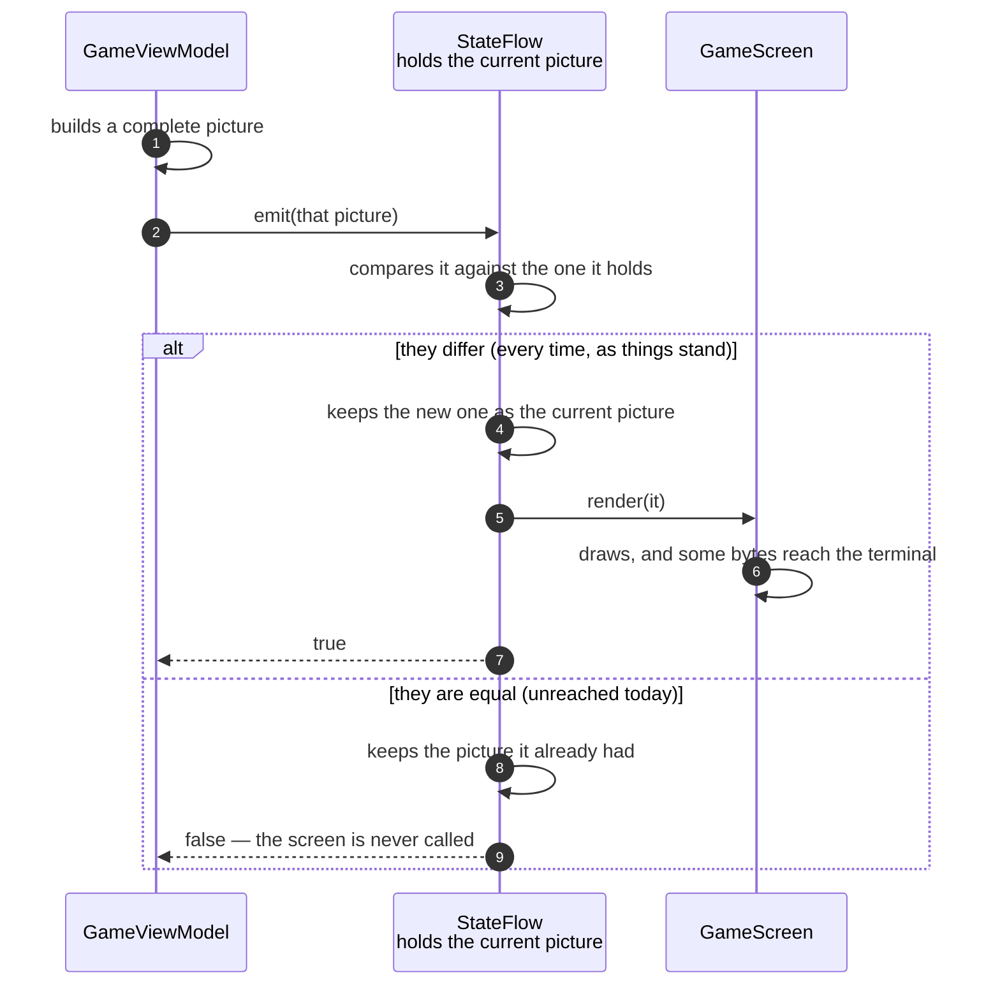

# An unchanged frame is dropped before it reaches the terminal

**Priority: `LOW`** — not because the comparison is unimportant, but because **on the program as it stands today nothing ever reaches it with an unchanged picture**. It is a guarantee rather than a saving. This document exists to say that plainly, since the comparison is easy to mistake for the thing that keeps the game cheap, and it is not. [What the priorities mean](SCENARIO_INDEX.md#what-the-priorities-mean).

Pictures are offered to a carrier before they are drawn, and the carrier
compares each one against the picture it already holds. If they are equal it
keeps the old one, tells the offerer nothing changed, and no drawing happens at
all. That is the whole mechanism, and it is
[eight lines long](../../terminalgame/util/flow.py#L56).

It works because a picture is [frozen](../../terminalgame/presentation/state.py#L68):
comparing two of them compares their contents rather than asking whether they
are the same object. Two separately built pictures of an identical game are
equal, and the carrier can tell.

## What actually reaches it

The interesting question is not how the comparison works but how often it says
"identical". The answer, measured on this version of the program by counting
every offer during two hundred clock beats and a hundred and sixty key presses,
eighty of them into walls:

| | |
|---|---|
| pictures offered to the carrier | 280 |
| published, because they differed | 280 |
| **dropped, because they were identical** | **0** |

Not "rarely". Never. Every path that could offer an unchanged picture now stops
before it builds one:

| Path | Why it never offers an unchanged picture |
|---|---|
| A clock beat | The count of beats is part of the picture and has just gone up, so the picture always differs |
| An arrow key into open corridor | The player has moved, so the picture always differs |
| An arrow key into a wall | [Returns before publishing](../../terminalgame/presentation/view_model.py#L312). No picture is built at all, so nothing is offered |
| A key that is neither an arrow nor a quit key | The loop ignores it. The view model is never called |
| Anything at all after the last pill | [Returns immediately](../../terminalgame/presentation/view_model.py#L289), beats included. Nothing is built and nothing is offered |

The wall press is the one worth noticing, because it is the case the comparison
was for. It used to be the path that produced identical pictures, and it does
not any more: refusing the move earlier is strictly better, since the picture
is never built, the layers are never assembled, and the comparison never has to
happen either.

## The offer, and the two answers

| Step | Message | What is going on |
|---:|---|---|
| 1 | builds a complete picture | Both maze layers, both moving characters, the line of readings. The building is the expensive half of a frame, and it has already happened by the time anything is compared — which is why dropping a picture here saves the *drawing*, never the *building* |
| 2 | [`emit`](../../terminalgame/util/flow.py#L56)`(that picture)` | The view model offers and moves on. It never learns which of the two branches below was taken, and nothing in the game reads the answer |
| 3 | compares it against the one it holds | A comparison of contents, not of identity. It stops at the first part that differs, and the parts are compared in the order they are written down: the walls first, then the pills, then the moving characters, then the readings, then the count of beats. The walls are the same unaltered object in every picture of a game, so that part costs nothing to compare |
| 4 | keeps the new one as the current picture | From this moment the carrier's idea of "what is on the screen" is the new picture, whether or not the drawing that follows succeeds |
| 5 | `render(it)` | The subscriber list is copied before it is walked, so a subscriber may unsubscribe while being called without disturbing the walk. There is exactly one subscriber in this program |
| 6 | draws, and some bytes reach the terminal | Between 56 and 95 bytes for an ordinary frame, measured |
| 7 | `true` | Meaning "that was new". Nothing consults it |
| 8 | keeps the picture it already had | The branch that never runs today. Note what it protects: not the terminal, which would have received almost nothing anyway, but the drawing code, which would have assembled thirty rows of characters and called into curses to discover there was nothing to do |
| 9 | `false` — the screen is never called | The screen cannot tell the difference between a frame that was dropped and a moment when nothing happened. It is only ever handed pictures |

## Why keep it

It costs one comparison per drawn frame — seven a second, of an object whose
first field is usually the identical object in both — and it buys an invariant
that holds no matter what is added later: **the screen is never asked to draw
a picture equal to the one already on it.** Any future thing that publishes on
a timer, or republishes after a resize, or recomputes a frame defensively, is
covered by a rule that already exists rather than needing its own guard.

There is a second reason, and it is the honest one: the comparison is what
makes a picture's equality *meaningful*. The pictures are frozen so that the
drawing code can never have one altered underneath it. Value equality comes
with that decision rather than being bought separately, and once you have it,
not using it would be the odd choice.

## What the terminal would have done anyway

Had an identical picture been drawn, almost nothing would have reached the
terminal: the layer underneath compares what it is asked to draw against what
is physically on the screen and sends instructions only for the positions that
differ. An identical frame differs nowhere. So the saving here is the work of
building the drawing, not the bytes on the wire — a distinction the README
makes at
[Full state or deltas?](../../README.md#full-state-or-deltas), and the reason this
scenario is `LOW` rather than `HIGH`.

## Related scenarios

- [An arrow key moves the player and repaints the screen](an-arrow-key-moves-the-player-and-repaints-the-screen.md)
  — the path this comparison was originally written for, which no longer
  reaches it.
- [A clock tick moves the ghost and repaints the screen](a-clock-tick-moves-the-ghost-and-repaints-the-screen.md)
  — the path that always differs, because the count of beats is part of the
  picture.
- [The last pill is eaten and the game is over](the-last-pill-is-eaten-and-the-game-is-over.md)
  — a finished game publishes nothing at all, which is a stronger form of the
  same idea: not an unchanged picture dropped, but no picture built.
