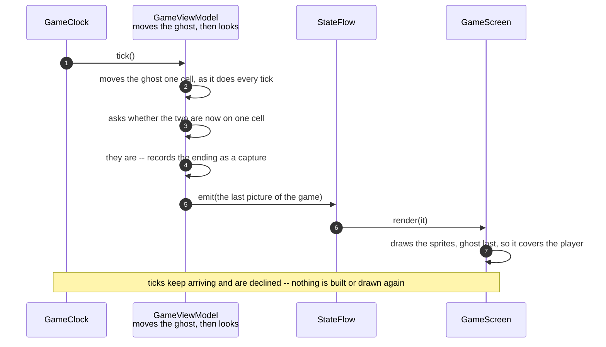

# The ghost catches the player and the game ends

**Priority: `MEDIUM`** — it happens at most once in a run, and in a good run it never happens at all. But it is the only thing in the game a player can lose to, and a fault here does not break the picture: it turns the ghost back into scenery with a colour, pacing the corridors and passing straight through the one thing it is supposed to threaten. [What the priorities mean](SCENARIO_INDEX.md#what-the-priorities-mean).

The ghost has been walking the maze since the first frame was drawn, choosing a
new direction whenever it runs out of corridor ahead. Now it walks into the
cell the player is standing on. The line of readings reads `CAUGHT`, the ghost
stops where it is, and the game is over — in exactly the same way it is over
when the last pill has been eaten, because that machinery was already there and
already written for more than one ending.

## Two ways to be caught, both the same rule

A capture is one thing: **the player and the ghost standing on the same cell.**
There are two moments it can become true, and each is checked immediately after
the move that could have caused it.

| The move | Where the check is | What it looks like to a player |
|---|---|---|
| The ghost steps onto the player | after the ghost's move, in [`tick`](../../terminalgame/presentation/view_model.py#L278) | the ghost came for them |
| The player steps onto the ghost | after the player's move, in [`on_direction`](../../terminalgame/presentation/view_model.py#L297) | they walked into it |

The check itself is
[a comparison of two cells](../../terminalgame/presentation/view_model.py#L354),
and it is worth saying what is *not* there. The usual way a collision check of
this kind is fooled is a swap: two things one cell apart trade places in the
same step, pass through each other, and are never seen sharing a cell. That
cannot happen here, and not because anything guards against it. **Nothing in
this game moves at the same time as anything else.** The ghost moves on a tick
and the player on a key press, one after another on a single thread, so a
swap takes two separate moves — and the check runs after each of them. The
first move puts them on the same cell and ends the game there.

That is the same single-threadedness that keeps the drawing free of tearing,
described in
[A clock tick moves the ghost and repaints the screen](a-clock-tick-moves-the-ghost-and-repaints-the-screen.md).
It is unusual for one decision to pay for itself twice in unrelated ways.

| Class | What it represents, and its part in this scenario |
|---|---|
| [`GameClock`](../../terminalgame/util/clock.py#L13) | The keeper of time, and on this path the **cause**: the ghost only ever moves because a tick was due |
| [`GameViewModel`](../../terminalgame/presentation/view_model.py#L226) | The **referee**: it moves the ghost, asks whether the two are now on one cell, records which of the two endings happened, and builds the last picture of the game |
| [`Maze`](../../terminalgame/presentation/maze.py#L31) | Consulted while the ghost is choosing where to walk, and not at all afterwards. It knows where corridors are and nothing about who is standing in them |
| [`StateFlow`](../../terminalgame/util/flow.py#L13) | The carrier, handed one more picture and then never troubled again |
| [`GameScreen`](../../terminalgame/ui/screen.py#L59) | The painter. It draws the sprites in the order it is given them, which is how the ghost comes to be on top in this one frame and underneath in every other |

## The tick that ends the game

| Step | Message | What is going on |
|---:|---|---|
| 1 | `tick()` | An ordinary beat, seven a second. Nothing about it knows this one is different |
| 2 | moves the ghost one cell, as it does every tick | The ghost carries straight on where it can and turns where it cannot, exactly as described in [A clock tick moves the ghost](a-clock-tick-moves-the-ghost-and-repaints-the-screen.md). It is not hunting: it does not know where the player is, and this cell was chosen the same way as every other |
| 3 | asks whether the two are now on one cell | [The check](../../terminalgame/presentation/view_model.py#L354) is a comparison of two pairs of numbers, and it happens **after** the move rather than before it. Checking before would ask whether the ghost is about to be somewhere, which is a harder question with the same answer one moment later |
| 4 | they are -- records the ending as a capture | The game keeps a **reason** rather than a flag, because it now has two ways to end. Everything that stops when a game stops was already written against that one value, so nothing else had to change to add this ending |
| 5 | `emit(the last picture of the game)` | The final frame differs from the one before it in two places: the ghost has moved onto the player, and the line of readings now says `CAUGHT` and the score |
| 6 | `render(it)` | The screen is handed the picture in the ordinary way. It is not told that this is the last one, and there is nothing special about drawing it |
| 7 | draws the sprites, ghost last, so it covers the player | The sprites are drawn in the order the picture lists them, and the last one wins where they overlap. Normally the player is last, so it stays visible as the ghost passes. On a capture that order would hide the thing that caused it, so [the picture lists them the other way round](../../terminalgame/presentation/view_model.py#L431) and the final frame shows a ghost where the player was |

## The other way round

A player can also walk into the ghost, and it is the same rule reached from the
other side: the player moves, and the check runs on the new cell. Two details
of that path are worth stating.

**The pill is still eaten.** The cell the ghost is standing on may still have
its pill — the ghost does not eat them — and a player who steps onto that cell
takes it and scores it before the capture is noticed. The score on the final
frame includes the pill they died on.

**A capture beats a cleared arena.** If that pill was the last one on the
board, both endings are true at once: the player has cleared it, and the player
has walked into the ghost. The capture is
[checked first](../../terminalgame/presentation/view_model.py#L297) and wins.
The reasoning is that the ghost was already standing there, and a player who
walks onto it has been caught whatever else was true of that cell.

## What stops, and what does not

Nothing here is new. A finished game is a finished game however it finished,
and all of it is described in
[The last pill is eaten and the game is over](the-last-pill-is-eaten-and-the-game-is-over.md):
the ghost stands still, the tick count stops, arrow keys do nothing, no further
picture is built, and not one byte more reaches the terminal. The loop keeps
going round, the clock keeps keeping time, and both are ignored.

The one thing that still works is quitting, for the same reason it always
works: the loop tests a key against the quit keys before it consults the view
model at all.

## Related scenarios

- [A clock tick moves the ghost and repaints the screen](a-clock-tick-moves-the-ghost-and-repaints-the-screen.md)
  — where the ghost's move comes from, and the single-threadedness this
  document leans on.
- [The last pill is eaten and the game is over](the-last-pill-is-eaten-and-the-game-is-over.md)
  — the other ending, and the description of everything that stops.
- [A pill is eaten and the score goes up](a-pill-is-eaten-and-the-score-goes-up.md)
  — the move a player is usually making when this happens to them.
- [A quit key ends the game and closes the window](a-quit-key-ends-the-game-and-closes-the-window.md)
  — the only thing left to do afterwards.

### Footnotes

[^viewmodel]: The **view model** is the part of the program that keeps track of
    what is happening in the game and turns that into pictures. It is
    [`GameViewModel`](../../terminalgame/presentation/view_model.py#L226). It is
    the only part that knows the game can end, which is why adding a second way
    of ending it changed nothing in the loop, the clock, the carrier or the
    screen.
