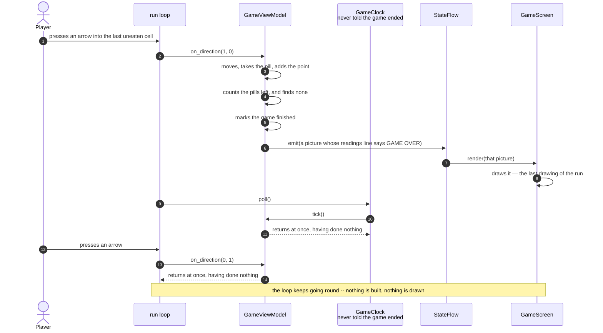

# The last pill is eaten and the game is over

**Priority: `MEDIUM`** — it happens at most once in a run, and only in a run somebody plays to the end. But it is the only ending a player can aim at -- the other two are giving up and [being caught](the-ghost-catches-the-player-and-the-game-ends.md) -- and a fault here means there is nothing to play *towards*: the arena empties and the game carries on as though nothing had happened. [What the priorities mean](SCENARIO_INDEX.md#what-the-priorities-mean).

The player takes the last pill on the arena. The line of readings stops naming
a score and reads `GAME OVER` instead, and from that moment the picture never
changes again. The ghost, which has been pacing the corridors since the game
began, stops where it stands. Arrow keys do nothing. The only keys that still
mean anything are the ones that quit.

Nothing exits. The program is still running, the loop is still going round, the
clock is still keeping time, and the window is still open. What has stopped is
everything the game does with those things.

That is a deliberate choice and worth defending, because ending the program
outright would have been less code. The ordinary way to start this game
[opens a window of its own](the-launcher-opens-the-game-in-its-own-terminal-window.md),
and that window is closed the moment the game finishes. A game that exited on
its last pill would therefore delete the player's final score from the screen
in the same instant it was earned. Stopping instead of exiting leaves the score
where the player can read it, and hands them the decision about when to close
the window.

## What "stopped" actually means

There is no flag being checked in the loop, and the loop was not modified at
all. The stopping happens entirely inside the view model[^viewmodel], in two
places, each of which simply declines to do anything:

| What still happens | What it does now |
|---|---|
| The clock reaches its next deadline and calls [`tick`](../../terminalgame/presentation/view_model.py#L278) | Returns at once. The ghost does not move, the count of ticks does not go up, and no picture is built |
| A player presses an arrow and the loop calls [`on_direction`](../../terminalgame/presentation/view_model.py#L297) | Returns at once. No move, no pill, no score |
| A player presses a quit key | Unaffected — the loop tests for quit before it consults the view model at all, so quitting cannot be broken by anything the game does |

Because neither of those two builds a picture, nothing is offered to the
carrier, nothing is drawn, and **not one byte reaches the terminal** for the
rest of the run. The finished picture is not held or redrawn or kept alive by
anything: it is simply the last one that was ever sent, still on the terminal
because nothing has overwritten it.

| Class | What it represents, and its part in this scenario |
|---|---|
| [`GameViewModel`](../../terminalgame/presentation/view_model.py#L226) | In this scenario it is the **referee**: [`_take_pill`](../../terminalgame/presentation/view_model.py#L327) counts the pills down, [`on_direction`](../../terminalgame/presentation/view_model.py#L297) notices the count has reached nothing, and [`_status_line`](../../terminalgame/presentation/view_model.py#L400) writes a different line from then on |
| [`GameClock`](../../terminalgame/util/clock.py#L13) | The keeper of time. In this scenario it is the part that **does not know**: [`poll`](../../terminalgame/util/clock.py#L62) goes on firing ticks at the usual rate for as long as the program runs, and is never told the game has finished. It is the view model that ignores them |
| [`main`](../../terminalgame/app/main.py) | The loop. Also never told. It keeps reading keys, keeps polling the clock, and keeps offering directions that are now declined |
| [`StateFlow`](../../terminalgame/util/flow.py#L13) | The carrier, which is simply never given anything again |
| [`GameScreen`](../../terminalgame/ui/screen.py#L59) | The painter, which draws the final picture and is then never called again |

## The last pill, and the quiet that follows



| Step | Message | What is going on |
|---:|---|---|
| 1 | presses an arrow into the last uneaten cell | An ordinary press. Nothing about it is special, and the player has no way of knowing in advance that this is the one — the score tells them how many they have taken, never how many are left |
| 2 | [`on_direction`](../../terminalgame/presentation/view_model.py#L297)`(1, 0)` | The same call as every other move |
| 3 | moves, takes the pill, adds the point | Exactly the story told in [A pill is eaten and the score goes up](a-pill-is-eaten-and-the-score-goes-up.md), up to and including the score |
| 4 | counts the pills left, and finds none | The count has been going down one at a time since the game began. It started at the number of corridor cells **less one**, because the pill the player was standing on at the start was taken silently and never counted as collected |
| 5 | marks the game finished | One value changes. That is the whole of the mechanism, and everything below follows from it |
| 6 | [`emit`](../../terminalgame/util/flow.py#L56)`(a picture whose readings line says GAME OVER)` | The line of readings is built fresh for every picture, and from now on [it takes the other branch](../../terminalgame/presentation/view_model.py#L423): the score, the words `GAME OVER`, and a reminder of the key that quits |
| 7 | `render(that picture)` | Nothing asked for it. The screen has been registered since startup and is handed the finished picture |
| 9 | draws it -- the last drawing of the run | Everything after this point in the diagram produces nothing at all. The picture on the terminal from here on is this one, left where it was drawn |
| 9 | `poll()` | The loop goes on polling the clock on every pass, exactly as it always has. The clock has not been stopped, and nothing has told it to stop |
| 10 | `tick()` | The clock's deadline arrives seven times a second, and seven times a second it calls a method that does nothing at all. That is a deliberate trade: leaving the clock running costs a call and a comparison per tick, and keeps the ending out of the loop and out of the clock, in the one class that knows what a pill is |
| 11 | returns at once, having done nothing | Not a picture, not an unchanged picture. Nothing is built, so the carrier is not even consulted |
| 12 | presses an arrow | The player can keep pressing for as long as they like |
| 13 | `on_direction(0, 1)` | Declined for the same reason and in the same way |
| 14 | returns at once, having done nothing | The arena stays exactly as the player left it |

## How the game can still be quit

The loop tests a key against the quit keys **before** it looks it up in the
table of directions, and before the view model is consulted at all. So the
route out is untouched by any of this, and it is untouched by design: a
finished game that could not be closed would be a program the player has to
kill. Pressing `q` or the escape key at this point runs the story told in
[A quit key ends the game and closes the window](a-quit-key-ends-the-game-and-closes-the-window.md),
in exactly the form it takes at any other moment.

## What a finished game leaves on the screen

The arena is bare. Every corridor cell is blank, because every pill has been
taken, and what remains is the walls, the two characters, and the readings
line:

```
|║   ║   ║   ■   ║   ║   ║   ╚═══╗   ║   |
|║   ║   ║       ║   ║           ║   ║   |
|║   ║   ╠════   ║   ╠═══════╗   ║   ║   |
|║       ║       ║   ║       ║       ║   |
|╠═══════╝   ■   ║   ║   ║   ╠════   ║   |
|║               ║       ║   ║       ║   |
|║   ╔═══════════╩═══════╝   ║   ║   ║   |
|║   ║                           ║   ║   |
|║   ║   ═════════   ════════════╝   ║   |
|║▗█▖                                ║   |
|╚═══════════════════════════════════╝   |
| GAME OVER  score 263  q quits          |
```

Two hundred and sixty-three is not a fixed number. It is the count of corridor
cells in that particular maze, less the one taken at the start, and every game
carves a different maze. The squares still visible are not pills that were
missed: they are one-cell islands of **wall**, drawn larger than a pill exactly
so that the two cannot be confused, and covered in
[A wall cell chooses its box-drawing glyph from its neighbours](a-wall-cell-chooses-its-box-drawing-glyph-from-its-neighbours.md).

## Related scenarios

- [A pill is eaten and the score goes up](a-pill-is-eaten-and-the-score-goes-up.md)
  — the same collaboration on every pass but the last.
- [The ghost catches the player and the game ends](the-ghost-catches-the-player-and-the-game-ends.md)
  — the other way a game ends by itself. It reaches this same stopped state by a
  different route, and says so on the readings line: `CAUGHT` rather than
  `GAME OVER`.
- [A quit key ends the game and closes the window](a-quit-key-ends-the-game-and-closes-the-window.md)
  — the only thing a player can still do here, and the only way the window closes.
- [A clock tick moves the ghost and repaints the screen](a-clock-tick-moves-the-ghost-and-repaints-the-screen.md)
  — what the ticks in steps 8 to 10 did before the game ended.

### Footnotes

[^viewmodel]: The **view model** is the part of the program that keeps track of
    what is happening in the game and turns that into pictures. It is
    [`GameViewModel`](../../terminalgame/presentation/view_model.py#L226). It holds
    whether the game has finished, and it is the only part of the program that
    does — which is why ending the game required no change to the loop, the
    clock, the carrier or the screen.
