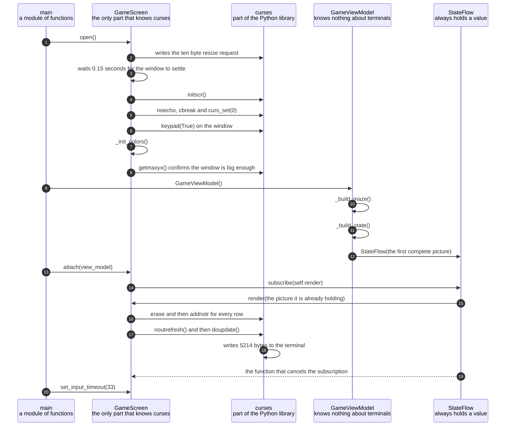

# The first frame is painted when the screen subscribes to the view model

**Priority: `HIGH`** — subscribing is the only place in the whole program where the drawing code is ever connected to the thing that produces pictures. If this collaboration is wrong, no picture ever reaches the terminal at all, on any run, no matter what happens afterwards. [What the priorities mean](scenario-priorities.md).

The game takes control of the terminal, builds its first complete picture, and
draws it. At the end of this scenario a player is looking at a bordered arena
with two characters in it, and the game is ready to accept a key press.

The valuable and slightly surprising part is how the first picture gets drawn.
Nothing in the program ever says "now draw the first frame". There is no such
instruction anywhere. Instead the screen asks to be told whenever the picture
changes, and the act of asking is itself what produces the first picture. This
is worth understanding because it removes a whole class of mistake. If the
first drawing were a separate instruction, somebody could forget to write it,
or could write it in the wrong place, and the game would start on a blank
window. Here it is impossible to subscribe and not be drawn to.

The arrangement rests on a rule about the thing that carries the picture from
one part of the program to another. That thing is called a state flow[^stateflow].
A state flow always holds a value. There is no such thing as an empty one. So
the view model[^viewmodel] cannot be built in a half-finished condition and
filled in later. It has to produce one complete, finished picture during its own
construction, before anything else can happen. That is why the first picture
already exists before the screen has even asked for it.

The order of the steps below is also chosen rather than accidental, and one
ordering decision is worth stating in advance. The screen takes over the
terminal **before** the view model is built. Taking over the terminal can fail,
because the player's window might be too small to hold the game. It is better to
discover that first and stop, rather than build a picture that then has nowhere
to go.

| Class | What it represents, and its part in this scenario |
|---|---|
| [`main`](../terminalgame/app/main.py) | The way into the program, and a module of plain functions rather than a class. In this scenario it is the **assembler**: [`run`](../terminalgame/app/main.py#L43) builds each of the other three parts, joins them together in one particular order, and then hands over to the loop that reads keys |
| [`GameScreen`](../terminalgame/ui/screen.py#L45) | The only part of the program that knows anything about curses[^curses] or about terminals. In this scenario it is the **painter**: [`open`](../terminalgame/ui/screen.py#L65) takes control of the terminal, and [`render`](../terminalgame/ui/screen.py#L149) turns one finished picture into characters on the screen. It never asks anybody for a picture. It is given them |
| [`GameViewModel`](../terminalgame/presentation/view_model.py#L30) | Everything the game knows about where things are and what has happened. In this scenario it is the **picture maker**: during its own construction it builds the arena, places the player and the ghost, and produces the first complete picture. It contains no mention of curses anywhere |
| [`StateFlow`](../terminalgame/util/flow.py#L13) | The carrier that holds the current picture and tells interested parties when it changes. In this scenario it is the **connector**, and the single most important part of the document: [`subscribe`](../terminalgame/util/flow.py#L30) both registers the screen and immediately hands it the picture it is already holding |

## Taking over the terminal, building the picture, and drawing it once

| Step | Message | What is going on |
|---:|---|---|
| 1 | [`open`](../terminalgame/ui/screen.py#L65)`()` | This is reached through a `with` statement in [`play`](../terminalgame/app/main.py#L69). Writing it that way means the matching [`close`](../terminalgame/ui/screen.py#L86) is guaranteed to run when the game ends, including when it ends because something went wrong. That guarantee matters more here than in most places. A program that stops without putting the terminal back leaves the player with a window that no longer echoes what they type |
| 2 | writes the ten byte resize request | This is [`_RESIZE_SEQUENCE`](../terminalgame/ui/screen.py#L36), a short run of characters that politely asks the terminal to become 30 rows by 80 columns. It is exactly ten characters long, which was measured by counting the bytes the program writes. Terminals that understand it resize themselves. Terminals that do not simply ignore it, which is why the size is checked properly further down. When the game is running in a window the launcher made, this request changes nothing at all, because that window was already made the right size |
| 3 | waits 0.15 seconds for the window to settle | The terminal program does not resize instantly, and it does not report back when it has finished. So the program waits a fixed [fifteen hundredths of a second](../terminalgame/ui/screen.py#L38) before measuring. Waiting a fixed time is not elegant, but there is nothing to wait for that can be asked |
| 4 | `initscr()` | This is the point where curses[^curses] takes control of the terminal. From here until the game ends, the program decides what every single character position contains |
| 5 | `noecho`, `cbreak` and `curs_set(0)` | Three separate settings, each removing something a terminal normally does. Without the first, every key the player presses would also be printed onto the playfield[^playfield]. Without the second, nothing would reach the game until the player pressed the return key. Without the third, the blinking cursor would visibly chase the drawing around the screen |
| 6 | `keypad(True)` on the window | The arrow keys do not arrive as single characters. Each one arrives as a short run of several characters. This setting asks curses to recognise those runs and hand back one tidy value for each arrow, so the game never has to decode them itself |
| 7 | [`_init_colors`](../terminalgame/ui/screen.py#L103)`()` | The game thinks about colour as five numbered slots, such as [`COLOR_GHOST`](../terminalgame/presentation/state.py#L20) and [`COLOR_PLAYER`](../terminalgame/presentation/state.py#L19). This is the only place those slots are attached to real colours. That indirection is what allows the view model to describe a red ghost without importing curses, and it is the reason the two halves of this program can be understood separately |
| 8 | `getmaxyx()` confirms the window is big enough | This is the real check, and it is the reason the polite request earlier is allowed to fail quietly. The program measures the window it actually has. If it is smaller than 30 by 80 it puts the terminal back the way it found it and stops with a clear explanation. The refusal path is a separate scenario, listed at the bottom |
| 9 | `GameViewModel()` | Building the view model is where the whole first picture comes from. Notice this happens **after** the terminal has been taken over and measured. Doing it the other way round would mean building a picture and then discovering there was nowhere to put it |
| 10 | [`_build_maze`](../terminalgame/presentation/view_model.py#L21)`()` | The arena is 29 rows tall, not 30. The last row of the window is kept for the line of readings underneath. That is [`MAZE_ROWS`](../terminalgame/presentation/view_model.py#L18), which is simply the playfield height with one taken off. The arena itself is a placeholder: a plain rectangle drawn with box-drawing characters, meant to be replaced later by a real maze |
| 11 | [`_build_state`](../terminalgame/presentation/view_model.py#L74)`()` | This gathers everything into one finished picture: the arena rows, the two moving characters, the line of readings, and the tick number, which starts at zero. Running the program confirms the starting arrangement. The player is at row 14 and column 40, which is the middle. The ghost is at row 11 and column 2, which is three rows above the player and hard against the left wall |
| 12 | `StateFlow(the first complete picture)` | The carrier is created with that picture already inside it. This is the step that makes the rest of the scenario work. A carrier that could be empty would allow a view model that was not yet ready, and then something would have to remember to fill it in later |
| 13 | [`attach`](../terminalgame/ui/screen.py#L125)`(view_model)` | One short instruction, and the only one in the program that joins the drawing half to the picture-making half. Everything after this happens because of it, without anything else being asked for |
| 14 | [`subscribe`](../terminalgame/util/flow.py#L30)`(self.render)` | The screen hands over its own drawing function and says "call this whenever the picture changes". Note what it does **not** do. It does not ask what the picture is now, and it never will. Information only ever travels in one direction here, from the view model towards the screen |
| 15 | `render(the picture it is already holding)` | **This is the first painting of the game, and nothing asked for it.** Subscribing calls the new subscriber straight away with the value already held. So registering an interest and receiving the current picture are the same single action, and it is impossible to do one without the other |
| 16 | `erase` and then `addnstr` for every row | The whole picture is drawn every time, rather than working out which parts changed. The program uses `erase` rather than the similar-looking `clear`, and the difference is important. `clear` would force the terminal to be completely repainted on the next refresh, which is exactly the flicker this is trying to avoid |
| 17 | `noutrefresh()` and then `doupdate()` | These two together are what make a frame arrive all at once instead of in pieces. The first prepares the changes without sending anything. The second sends them, in a single write. A picture that arrived in several separate writes could be caught half drawn |
| 18 | `writes 5214 bytes to the terminal` | Measured, not estimated. The game was run inside a false terminal of exactly 30 rows by 80 columns and every byte it wrote was counted. This first burst is larger than every later one put together, because it carries the whole arena as well as all the setting-up instructions. What a later frame costs is covered in the tick scenario |
| 19 | the function that cancels the subscription | Subscribing hands back a small function that undoes it. The screen keeps hold of it and calls it when the game ends. Without that, the screen would still be registered as interested in pictures after it had given the terminal back, and a late picture would be drawn into a terminal the program no longer controls |
| 20 | [`set_input_timeout`](../terminalgame/ui/screen.py#L133)`(33)` | The last piece of setting up, and it is about the future rather than about this picture. It says that waiting for a key should give up after [thirty-three thousandths of a second](../terminalgame/app/main.py#L32) so that the loop can go and check the clock. This is done after the first painting because it has no bearing on it. What it is for belongs to the tick scenario |

This diagram has no coloured bands marking threads, and the absence is a
decision worth naming. The whole of this program runs on one single thread.
Every step above happens one after another, in exactly the order shown, with
nothing happening elsewhere in between. The reason is that curses is not safe to
use from more than one thread at once: a picture arriving from somewhere else
while a picture is halfway drawn would corrupt the display.

## Related scenarios

- [A clock tick moves the ghost and repaints the screen](a-clock-tick-moves-the-ghost-and-repaints-the-screen.md)
  — what every picture after this first one costs, and the path they all take.
  The subscription made here is the one every later picture travels along.
- [The launcher opens the game in its own Terminal window](the-launcher-opens-the-game-in-its-own-terminal-window.md)
  — what happened immediately before this, in a different copy of the program,
  and why the resize request in this document usually changes nothing.
- **A terminal too small to hold the playfield is refused** — the other outcome
  of the measuring step, where the program puts the terminal back as it found
  it and stops with an explanation instead of continuing.

*(The entry above that is not a link is a document that has not been written
yet.)*

### Footnotes

[^stateflow]: A **state flow** is the small piece of machinery that carries the
    picture from the part of the program that makes pictures to the part that
    draws them. It has three properties, and all three matter.
    It always holds a value, so there is never an empty one.
    Anybody who registers an interest is handed the current value straight
    away, rather than waiting for the next change.
    And a value equal to the one already held is quietly dropped rather than
    passed on. The whole of it is
    [`StateFlow`](../terminalgame/util/flow.py#L13), which is under seventy
    lines long.

[^viewmodel]: The **view model** is the part of the program that keeps track of
    what is happening in the game and turns that into pictures. It holds where
    the player is, where the ghost is, and how many ticks have passed. It is
    [`GameViewModel`](../terminalgame/presentation/view_model.py#L30). It never
    draws anything and contains no mention of curses[^curses] at all, which is
    what allows it to be read and tested without a terminal being involved.

[^curses]: **curses** is a library included with Python for controlling a text
    terminal: putting a character at a chosen row and column, choosing colours,
    and reading keys as they are pressed rather than a line at a time. The
    working part underneath it is a much older piece of software called
    ncurses. Its most useful trick is that it keeps its own copy of what is
    currently on the screen, compares that against what the program has just
    drawn, and sends instructions only for the character positions that
    actually differ.

[^playfield]: The **playfield** is the fixed rectangle of character positions
    the game draws into: 30 rows tall and 80 columns wide, set by
    [`PLAYFIELD_ROWS`](../terminalgame/presentation/state.py#L12) and
    [`PLAYFIELD_COLS`](../terminalgame/presentation/state.py#L13). The top 29
    rows hold the arena. The last row holds a line of readings showing the tick
    number and where the player is. A window larger than this is perfectly
    acceptable, and the game simply draws in the top left corner of it.
