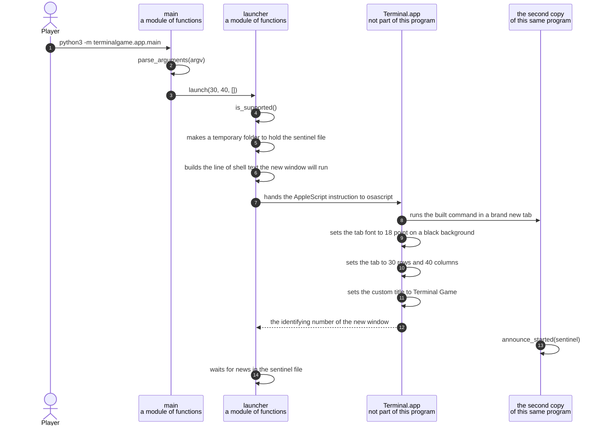

# The launcher opens the game in its own Terminal window

**Priority: `MEDIUM`** — this happens once for each run of the program, and only on the ordinary way of starting it. A player can still play the game in the window they are already using by adding the word `--here`, so a fault here costs the separate window rather than the picture. [What the priorities mean](SCENARIO_INDEX.md#what-the-priorities-mean).

A player types one command. A new window appears, already the exact size the
game needs, and the game is running inside it.

The value of this scenario is that the player never has to prepare anything.
They do not have to resize a window by hand, and they do not have to work out
what size the game wants. They also do not lose the ordinary behaviour of a
command. The command they typed does not finish the moment the new window
opens. It stays running, quietly waiting, and finishes only when the game
finishes. That means the command can be used inside a script, or joined to
another command, exactly like any everyday command would be.

Two separate copies of the program are involved, and keeping them straight is
the key to reading the diagram below. The first copy is the one the player
started. It never draws any part of the game. Its entire job is to ask the
terminal program[^terminalapp] for a window and then wait. The second copy runs
inside that new window, and it is the one that draws the game. Both copies are
the same file, started the same way. What tells them apart is a single setting
placed into the second copy's environment[^environment], named
`TERMINALGAME_CHILD`.

There is a firm rule about which copy is allowed to do what, and it is enforced
rather than merely intended. The second copy is never allowed to open a window
of its own. If it were, that window's copy would open another window, and each
one would be a real window appearing on the player's screen. So
[`launch`](../terminalgame/app/launcher.py#L218) refuses outright, straight
away, if it finds `TERMINALGAME_CHILD` already set in its own environment.

One more decision is worth stating before the diagram, because it explains why
the window looks the way it does. The terminal program allows the number of
rows and the number of columns of a tab to be set directly. So the window is
created at the size the game wants, rather than opened at whatever size the
player's settings say and then stretched afterwards. A window that appeared at
one size and then jumped to another would be visible, and slightly unpleasant to
watch. This way there is nothing to see.

| Class | What it represents, and its part in this scenario |
|---|---|
| [`main`](../terminalgame/app/main.py) | The way into the program. This is a module of plain functions rather than a class. In this scenario it is the **doorman**: [`parse_arguments`](../terminalgame/app/main.py#L121) works out which of the two copies this one is, and [`main`](../terminalgame/app/main.py#L148) then sends it either to open a window or to play the game |
| [`launcher`](../terminalgame/app/launcher.py) | Everything the program knows about asking the terminal program for a window. This is also a module of plain functions rather than a class. In this scenario it is the **host**: it builds the command the new window will run, asks for the window, and then waits for the game inside it to finish |
| `Terminal.app` | The terminal program that comes with macOS. This is not part of this program at all. In this scenario it is the **window maker**: it is the only thing here that can put a window on the screen, and it is driven by instructions written in AppleScript[^applescript] |
| the second copy | The same program, started again inside the new window. In this scenario it is the **player of the game**. It is not a separate class, and it shares every line of code with the first copy. The only thing that distinguishes it is the `TERMINALGAME_CHILD` setting in its environment |

## Asking the terminal program for a window, and then waiting

| Step | Message | What is going on |
|---:|---|---|
| 1 | `python3 -m terminalgame.app.main` | The program is started as a module rather than as a file, which is what the `-m` part means. This matters more than it looks. The code inside the package refers to its neighbours by their position relative to itself, and that only works when the program is started this way. Starting the file directly by its path would fail before anything was drawn |
| 2 | [`parse_arguments`](../terminalgame/app/main.py#L121)`(argv)` | This reads the words the player typed, and then does one extra thing that the words alone cannot tell it. It looks in the environment for [`ENV_CHILD`](../terminalgame/app/launcher.py#L64), the setting named `TERMINALGAME_CHILD`. Finding nothing there is how this copy knows it is the first one. The setting is carried in the environment rather than as an extra word on the command, because the terminal program puts the words of the running command into the window's title bar, and the player would then see the program's private plumbing written across the top of the window |
| 3 | [`launch`](../terminalgame/app/launcher.py#L218)`(30, 40, [])` | The 30 and the 80 are the height and width the game needs, measured in character positions rather than in dots. They come from [`PLAYFIELD_ROWS`](../terminalgame/presentation/state.py#L13) and [`PLAYFIELD_COLS`](../terminalgame/presentation/state.py#L14), which the program chooses for itself. The first thing `launch` does is not shown as a message because nothing is called: it checks its own environment for `TERMINALGAME_CHILD` and refuses immediately if it is there. That is the guard that stops a window opening a window opening a window |
| 4 | [`is_supported`](../terminalgame/app/launcher.py#L153)`()` | Asking for a window this way only works on macOS, and only when the tool that runs AppleScript[^applescript] instructions is present on the machine. If either is missing, the program says so and tells the player to use `--here` instead. It does not fail silently and it does not try anything clever |
| 5 | makes a temporary folder to hold the sentinel file | A sentinel file[^sentinel] is a small file used purely as a message between the two copies of the program. It is made now, before the window exists, so that the second copy has somewhere agreed to write to the moment it starts |
| 6 | [builds the line of shell text](../terminalgame/app/launcher.py#L184) the new window will run | This writes out the single line of shell text the new window will run. The line moves to the folder holding the program, clears the window, sets the two settings that mark the second copy, and then starts the program again. It uses the word `exec`, which replaces the shell with the program rather than running the program underneath it. That detail matters at the very end of the game: a tab with nothing running in it closes without the terminal program stopping to ask the player whether they really mean it |
| 7 | hands the [AppleScript instruction](../terminalgame/app/launcher.py#L55) to osascript | This is the instruction written in AppleScript[^applescript] that actually makes the window. It is handed to a separate tool, named `osascript`, which is what carries instructions from a program to another application on macOS |
| 8 | runs the built command in a brand new tab | The new window starts running the line built earlier. From this moment the second copy of the program exists and is starting up. What it does next is a separate scenario, linked at the bottom of this document |
| 9 | sets the tab font to 18 point on a black background | Both are properties of the tab rather than of a saved profile, so the game window can look how it likes without changing any other terminal window the player has open. The [point size](../terminalgame/app/launcher.py#L38) is set before the row and column counts, so those settle against the final character size: if a larger font ever made the window too big for the display, the terminal would hand back fewer rows and the game would stop at startup with a clear message rather than running in a window of the wrong shape |
| 10 | sets the tab to 30 rows and 40 columns | This is the step that avoids the visible jump. The terminal program allows these two numbers to be set directly on a tab, so the window can be made the right size rather than corrected afterwards |
| 11 | sets the custom title to Terminal Game | The title is fixed to the words in [`WINDOW_TITLE`](../terminalgame/app/launcher.py#L30), and the parts of the title the terminal program would otherwise fill in for itself are switched off. Without this the player would see the folder name and the words of the running command instead |
| 12 | the identifying number of the new window | Every window has a number that identifies it. The launcher finds the right one by matching the terminal device[^tty] of the tab it just made, then remembers the number so that it can close that exact window later. Windows that were closed a moment ago linger in the terminal program's own list for a while as empty shells, and asking one of those about its tabs causes an error, so every single window is examined inside its own guard |
| 13 | [`announce_started`](../terminalgame/app/launcher.py#L166)`(sentinel)` | The second copy writes its own process number[^pid] into the sentinel file. This is the first word the first copy hears from it. The file is written under a different name and then renamed into place, which on this kind of computer happens all at once, so the reader can never catch the file half written |
| 14 | [waits for news](../terminalgame/app/launcher.py#L244) in the sentinel file | The first copy now settles into waiting. It reads the sentinel file every [tenth of a second](../terminalgame/app/launcher.py#L53). That is a cheap thing to do, because it only touches a small local file, and it deliberately sends no further instructions to the terminal program while the game is running. It also watches whether the process number it was given is still alive, so that a player who closes the window by hand does not leave the first copy waiting forever. If nothing at all is heard within [twenty seconds](../terminalgame/app/launcher.py#L24), the launcher gives up and says the window never started |

This diagram has no coloured bands marking threads, and that is deliberate
rather than an omission. Each copy of the program runs on a single thread from
start to finish. There is a boundary in this picture, but it is a boundary
between two separate programs running at once, and it sits at the terminal
program in the middle. Both copies of this game are as simple as a program can
be on the inside.

## Related scenarios

- [The first frame is painted when the screen subscribes to the view model](the-first-frame-is-painted-when-the-screen-subscribes-to-the-view-model.md)
  — what the second copy does immediately after it writes into the sentinel
  file, ending with the first picture appearing in the new window.
- [A quit key ends the game and closes the window](a-quit-key-ends-the-game-and-closes-the-window.md) — the other half of the
  sentinel file arrangement. The game writes the number it finished with, the
  first copy reads it, waits for the game to actually disappear, and only then
  asks for the window to be closed.
- **The game is played in the window the player is already using** — what
  happens when the player adds `--here`, so that none of the steps in this
  document run at all.

*(The remaining entry that is not a link is a document that has not been
written yet.)*

### Footnotes

[^terminalapp]: The **terminal program** is the application that draws a window
    full of text and lets a person type into it. On macOS the one that comes
    with the computer is called Terminal, and this program drives that
    particular one. It is a completely separate application. This game can ask
    it for a window and can ask it to close one, but it cannot draw a single
    character except by writing text into a window the terminal program is
    already showing.

[^environment]: The **environment** is a small set of named values that every
    running program is given when it starts, and which it passes on to any
    program it starts in turn. It is an ordinary way for one program to tell
    another something before that other program begins. This game uses two of
    them, [`ENV_CHILD`](../terminalgame/app/launcher.py#L64) and
    [`ENV_SENTINEL`](../terminalgame/app/launcher.py#L65).

[^applescript]: **AppleScript** is a language for telling one macOS application
    what to do from outside it. The instructions read almost like English
    sentences. This program uses it for exactly two things: asking for a new
    window with a given size and title, and later asking for that same window
    to be closed. The instructions are carried across by a separate tool named
    `osascript`.

[^sentinel]: A **sentinel file** is a small file that two programs agree to use
    as a way of passing a short message. One writes into it and the other reads
    it. Nothing else ever looks at it. Here it carries just two pieces of news,
    one after the other: first the process number[^pid] of the game once it is
    running, and later the number it finished with. It is used instead of
    repeatedly asking the terminal program for news, because reading a small
    local file is very cheap and asking another application a question is not.

[^tty]: A **terminal device** is the name the computer gives to one particular
    text window, so that a program writing to that window and a program reading
    from it are talking about the same place. It looks like a file name. The
    launcher uses it purely as a label: it asks the terminal program for the
    device belonging to the tab it just created, then looks through all the
    windows for the one whose tab carries that same label.

[^pid]: A **process number** is a whole number the computer gives to each
    running program so that it can be referred to. It is often written as
    `pid`, which is short for process identifier. The launcher uses the game's
    process number for one purpose only: to ask, every tenth of a second,
    whether that program is still running.
